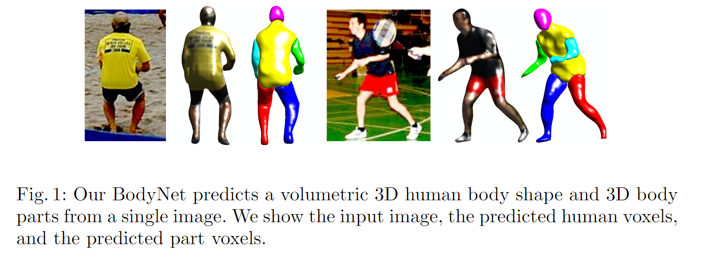
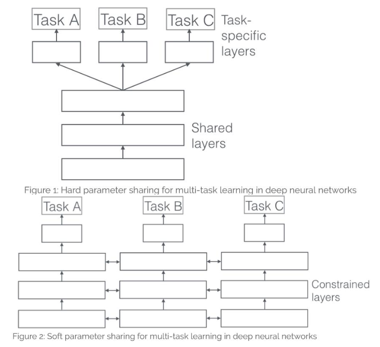
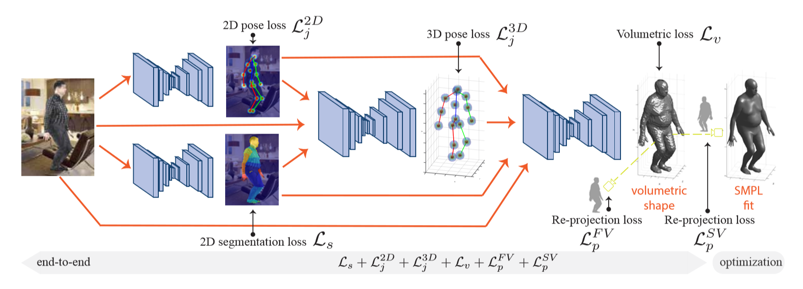
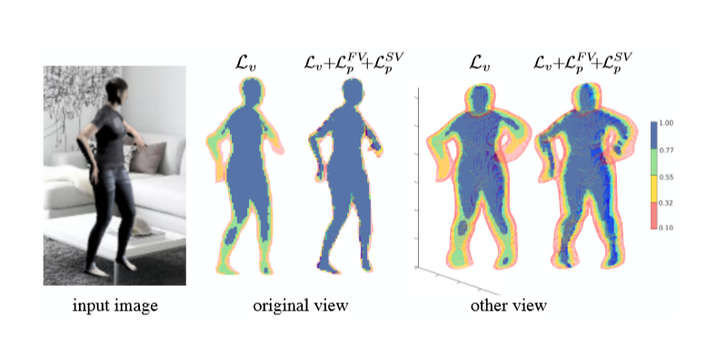

# BodyNet: Volumetric Inference of 3D Human Body Shapes学习笔记

时间：2019/1/27

论文来源：[BodyNet: Volumetric Inference of 3D Human Body Shapes]( https://arxiv.org/pdf/1804.04875.pdf)

------

## 一. 主要工作

该篇论文中提出了一个名叫BodyNet的端对端的多任务网络（multi-task network）。BodyNet能够从单张图片中预测3D shape信息，后续可以被改进用于3D body part segmentation。

BodyNet主要通过以下几项进行优化训练：

1. 体表示的3D loss
2. 对预测的体结构进行多视角投影的multi-view re-projection loss
3. 对于2D pose，2D body segmentation和3D pose的中继监督

------

## 二. 相关技术

### 1.  3D human shape estimation

3D shape的表示方法有很多种：体素（voxel），八叉树（octree），点云（point cloud）和模型面片（surface）等。具体哪种表示最适用于神经网络还是个未知数。

现在常用的方法是基于**参数化的可变形模型** ，利用神经网络去预测shape参数。这样的做法有一些缺点：

1. 3D shape和模型的shape参数之间的对应关系是非线性的，这样的关系对目前的神经网络来说是很难学习的
2. 需要有先验的（prior）shape参数才能进行训练

所以本篇论文中没有使用这种表示，而是采用**体表示（volumetric representation）** 方法，把shape表现为在3D空间中的occupation

### 2. Multi-task neural networks

在机器学习中，我们通常关心优化某一特定指标，为了达到这个目标，我们训练单一模型或多个模型集合来完成指定得任务。然后，我们通过精细调参，来改进模型直至性能不再提升。尽管这样做可以针对一个任务得到一个可接受的性能，但是我们可能忽略了一些信息，这些信息有助于在我们关心的指标上做得更好。具体来说，这些信息就是相关任务的监督数据。通过在相关任务间共享表示信息，我们的模型在原始任务上泛化性能更好。这种方法称为**多任务学习（Multi-Task Learning）**

在基于深度神经网络的多任务学习中常用两种方法：隐层参数的**硬共享（Hard parameter sharing）**与**软共享（Soft parameter sharing）**。

1. 参数的硬共享机制：参数的硬共享机制是神经网络的多任务学习中最常见的一种方式。一般来讲，就是多个任务共享隐层的模型和参数，在网络的终端处分支产生不同任务的结果
2. 参数的软共享机制：每个任务都有自己的模型和参数，多个子网络堆叠在一起，使用中继监督（intermediate supervision）进行优化

------

## 三. BodyNet

BodyNet由4个自网络组成，他们的任务分别是：

1. 预测2D pose
2. 预测2D body part segmentation
3. 预测3D pose
4. 预测3D shape

### 1. 3D shape的体表示

3D shape被表示为一个固定分辨率的体素空间中的occupancy map，body内部的体素被标记为occupied。这个体素空间中心与body的hip joint重合，尺度被适当放缩至与2D的segmentation mask匹配。

3D shape通过与ground truth的二叉熵损失$L_v$优化

现有的体素是二分类的（occupied/unoccupied），如果使用多分类（eg.不同的body part不同标记），并用多类交叉熵损失进行优化，这个框架就可以用来对3D body part segmentation进行预测

### 2. Multi-view re-projection

因为人体的复杂的关节和肢体比例关系，对于离躯干较远的部分（四肢，手，脚etc）的体表示预测的可信度就比较低，为了解决这个问题，就加入了2D re-projection loss。

对重建的体表示结果进行正投影和侧投影，得到front/side view的剪影，与对应view的ground truth计算二叉熵损失$L_p^{FV}$和$L_p^{SV}​$

### 3. 对multi tasks进行中继监督

3D shape是从RGB，2D pose，2D segmentation和3D pose中得到的，后三者是分别从对应的子网络中得到的，这些子网络都基于Hourglass network。

RGB：$3\*256\*256 ​$

2D pose：$16\*64\*64 ​$ （16个keypoints的heatmap），均方差损失$L_j^{2D}​$

2D segmentation：$15\*64\*64 $ （15个body part的heatmap），空间交叉熵损失$L_s$

3D pose：表示为$64\*64\*19$的体空间中的点（与3D shape）同一空间，（x,y）与2D pose相同，深度z通过2D segmentation的遮挡关系推算。使用均方差损失$L_j^{3D}$

综上，end-to-end的损失函数$L$为：
$$
L=\lambda_j^{2D}L_J^{2D}+\lambda_j^{3D}L_J^{3D}+\lambda_vLv+\lambda_p^{FV}L_p^{FV}+\lambda_p^{SV}L_p^{SV}
$$
训练时首先单独训练各子网络，然后联合训练$L_v$，$L_p^{FV}$和$L_p^{SV}$ ，最后进行end-to-end训练

PS：在得到了3D体表示结果后，可以得到对应的等值面（isosurface）数据，然后就可以用ICP方法拟合SMPL模型了
