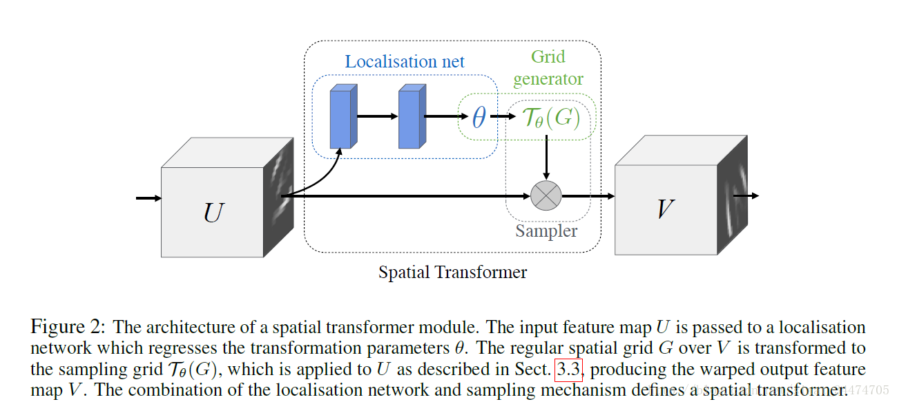
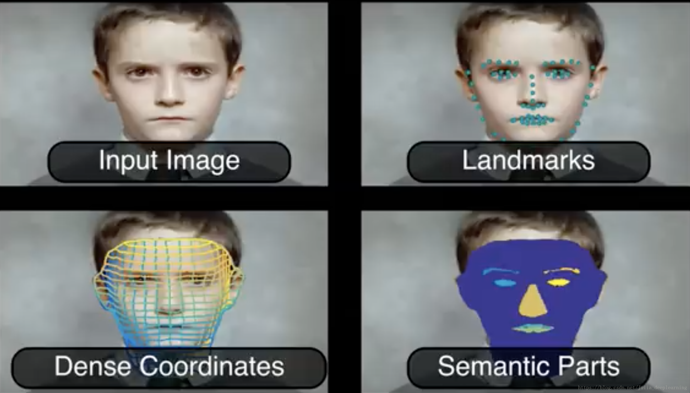
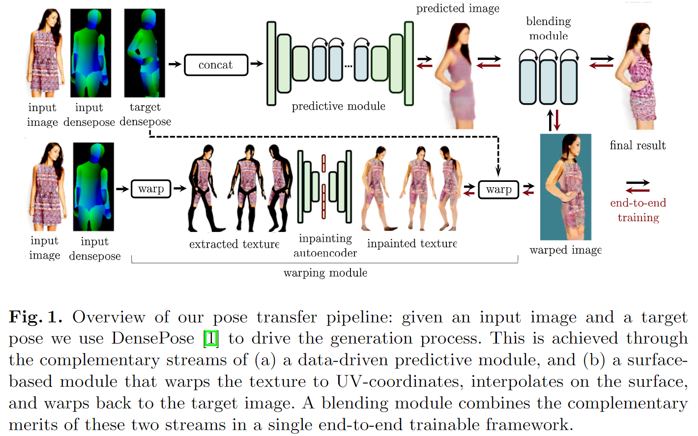
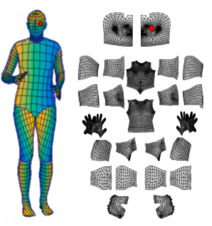
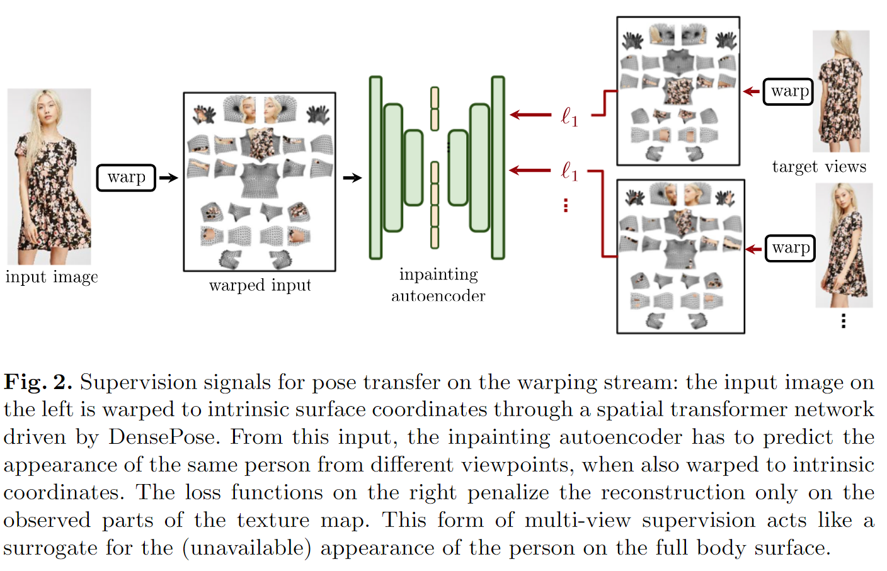
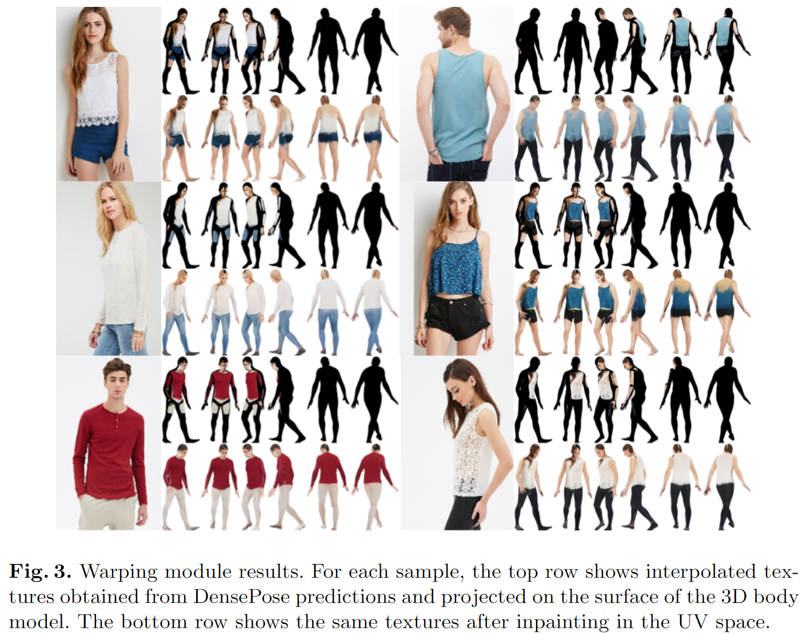
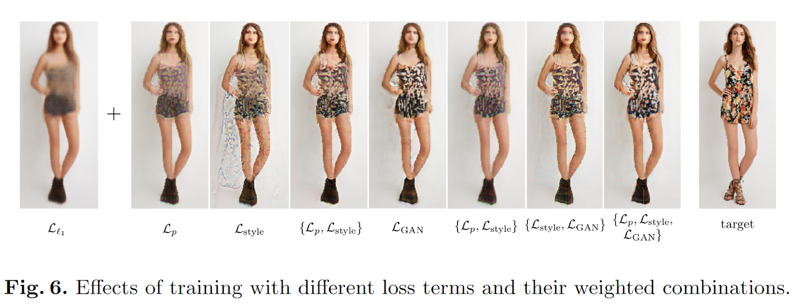

# Dense Pose Transfer学习笔记

时间：2019/2/1

论文来源：[Dense Pose Transfer]( http://openaccess.thecvf.com/content_ECCV_2018/papers/Natalia_Neverova_Two_Stream__ECCV_2018_paper.pdf)

------

## 一. 主要工作

该篇论文中将基于表面模型的姿态估计方法（surface-based pose estimation）和深度生成模型（deep generative model）结合起来，提出了精确的姿态转化（pose transfer）方法

该方法利用SMPL模型和DensePose system，通过基于表面的神经合成（neural synthesis），渲染new pose的人物模型，从而生成pose-transfered图像

------

## 二. 相关技术

### 1. Deep generative models

生成模型（Generative Model）是相对于判别模型（Discriminative Model）定义的。他们两个都用于有监督学习：

- 判别模型主要是根据原始图像推测图像具备的一些性质，例如根据数字图像推测数字的名称，根据自然场景图像推测物体的边界；
- 生成模型通常给出的输入是图像具备的性质，而输出是性质对应的图像。这种生成模型相当于构建了图像的分布，因此利用这类模型可以完成图像自动生成（采样）、图像信息补全等工作。

Deep generative models表示的是基于深度学习的生成模型，常用作一种无监督的特征学习的方法。

### 2.Image inpainting

图像补全(image inpainting)就是还原图像中缺失的部分。基于图像中已有信息，去还原图像中的缺失部分。这项技术可以帮助估测被遮挡的部分的模样，通常使用生成模型来补全信息

### 3. STN

空间变换网络（Spatial Transformer Net，STN）让网络明确地利用了数据的空间信息，可以在网络中对数据进行空间变换操作。这种可导的模块可以插入到现有的卷积结构中，赋予网络在不需要额外训练监督或者修改优化过程的情况下，基于特征图（feature map）本身进行空间变换的能力。

ST的结构分成三部分，分别为Localisation Net, Grid Generator和Sampler，它完成的是一个将输入特征图进行一定的变换的过程，而具体如何变换，是通过在训练过程中学习来的。更通俗地讲，该模块在训练阶段学习如何对输入数据进行变换更有益于模型的分类，然后在测试阶段应用已经训练好的网络对输入数据进行执行相应的变换，从而提高模型的识别率。

### 4. DensePose

DensePose（密集姿态估计）是一项将2D RGB图像的所有人类像素实时映射至3D模型的技术。DensePose 利用深度学习将 2D RPG 图像坐标映射到 3D 模型表面，把一个人分割成许多 UV 贴图（UV 坐标），然后处理密集坐标，实现动态人物的精确定位和姿态估计。

对比2D keypoints detection技术只能检测人体的10到20个关节点位置，DensePose涉及整个人体，需要超过5000个节点。

------

## 三. 具体工作

Dense Pose Transfer的输入是RGB图片，target pose通过“pose donor”（摆出目标姿势的其他人物的图片）来表示。通过使用DensePose处理图片，就能得到图片中人物的每个像素映射到3D模型表面的坐标（densepose）。

进一步对DensePose的输出通过两个模块——predicative module和warping module，进行处理：

| 模块 | Predicative Module                                           | Warping Module                                               |
| ---- | ------------------------------------------------------------ | ------------------------------------------------------------ |
| 任务 | 基于RGB image，input densepose和target densepose生成target pose的人物图片 | 基于RGB image和input densepose，使用图像补全技术生成完整的纹理贴图，然后生成target pose的人物图片 |
| 优点 | 通过充分利用target densepose的信息，能够生成姿势高度还原的仿真图片 | 可以保留高质量的纹理细节，可以在纹理空间进行纹理图像补全，并且可以通过调整模型姿势得到任意姿势的人物图片 |
| 缺陷 | 不能创造（没有姿势参考）姿势；不能很好的转化纹理细节         | 重建模型时不能捕获头发和衣服形状的信息，最终生成的图片也会缺乏这些特征信息 |

由于这两个module优势互补，所以使用一个blending module来混合并优化这两个module的输出，得到最终的输出图像

### 1. DensePose module

DensePose module输出的是image和3D模型之间的密集匹配。

对于image中的属于human部分的每个像素，首先将像素分类到预先划分出的24个part中的一个，然后通过回归得到part-specific的坐标系中该像素的对应UV坐标。

对human部分的每个像素进行这样的映射之后，输出每个像素对应的part label，U坐标和V坐标。这样的输出被应用到predicative module和warping module中。

### 2. Predicative module

Predicative module有三个输入：RGB image，input densepose和target densepose，将三个输入堆叠在一起就是一个$256\*256\*9$的input，这个input既包含了全局的信息（part分类），又包含了point-level的信息（连续的映射坐标）

通过predicative module处理之后，就能得到target pose的人物图片。这一图片中很好地还原了target pose和头发，衣物形状等信息，但是衣物的样式纹理非常模糊。

### 3. Warping module

Warping module通过直接进行纹理映射来实现pose transfer。

首先，根据RGB image和input densepose，使用一个STN模块把图像信息映射到模型的UV坐标空间中，相当于给3D模型进行了纹理贴图。

由于image之中只有部分可见信息，得到的初步纹理是不完全的，模型的很多地方没有纹理覆盖。因此需要一个inpainting network来对纹理进行补全。

- **inpainting autoencoder** ：RGB image被变换到UV空间后得到warped input，根据这个input，inpainting autoencoder需要预测不同视角下的人物的warped结果。通过惩罚在不同视角下可见部分的预测错误来训练这个网络。这样就可以修复得到整体的纹理，而不只是target pose的纹理
- **inpainting net** 由N个（对应N个densepose part）这样的autoencoder组成，这样就可以修复得到N个UV坐标系下的完整纹理贴图

最后，再通过一个逆向映射，把UV空间的纹理信息转化到output image空间，就得到了target pose下的人物图片

### 4. Blending module

Blending module把predicative module和warping module的输出进行优势结合，然后通过优化损失函数来对输出结果进行finetune

损失函数项如下：

- **Reconstruction loss** ：惩罚输出图像和ground truth之间的$l_1$ 距离
- **Perceptual loss** ：惩罚输出图像和ground truth的feature map之间的$l_2$距离
- **Style loss** ：没看懂
- **Adversarial loss** ：使用patch-GAN discriminator来检测局部纹理与真实样本之间的区别，目的是提高纹理的真实性 
