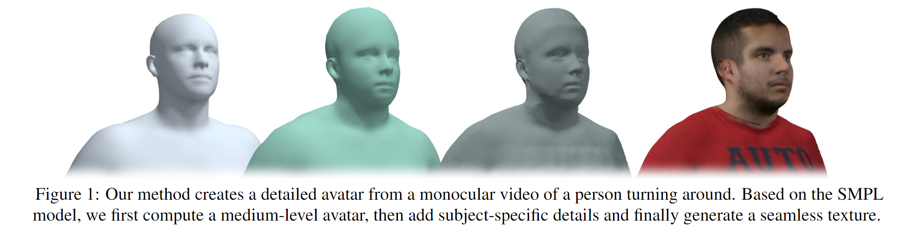
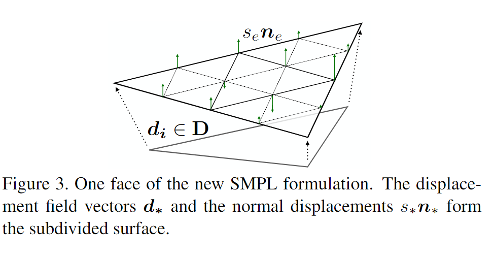
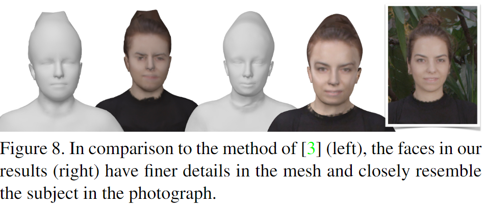
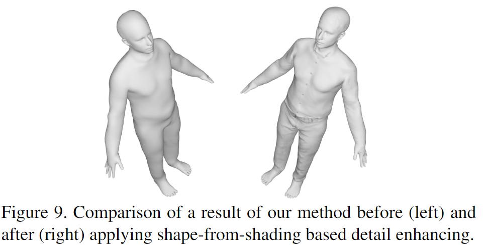
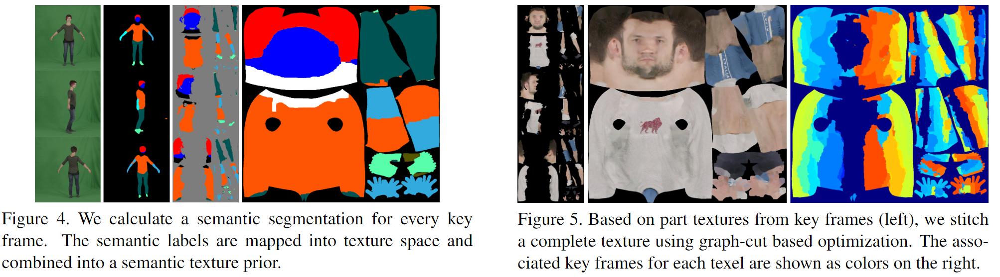

# Detailed Human Avatars from Monocular Video 学习笔记

时间：2019/1/23

论文来源：[Detailed Human Avatars from Monocular Video]( https://virtualhumans.mpi-inf.mpg.de/papers/alldieck2018detailed/alldieck2018detailed.pdf)

------

## 一. 主要工作

由于之前从[单目视频中重建的模型]( https://arxiv.org/pdf/1803.04758.pdf)过于平滑，缺少面部的细节，并且纹理贴图过于模糊，本篇论文中提出了一些优化的措施，目的是建立更加真实的的人物模型

在之前工作的基础上，主要从四个方面进行优化：

1. 面部关键点（Facial landmarks）：将2D的facial landmarks检测信息运用在了3D重建的过程中
2. 根据阴影信息复原形状（shape-from-shading）：使用阴影信息来恢复一些比较细节的形状信息，比如衣服的褶皱等
3. 纹理缝合（texture stitching）：定义了新的纹理更新能量方程，运用图像分割算法，缝合不同视角的纹理图片
4. 纹理语义：为了解决texture spilling问题，在纹理缝合过程中加入语义信息

------

## 二. 相关技术

### 1. Shape-from-shading

Shape from shading是由Horn于1980年提出的一种单幅图像恢复三维信息的一种方法（Single Image-based Reconstruction），根据光源和灰度图像可以计算得到物体表面任意点的法向量。在对人体进行3D重建的过程中，一些细节的几何信息难以通过剪影信息进行恢复，就很适合用SFS。

### 2. 图像分割 GraphCut

图像分割指的是根据灰度、颜色、纹理和形状等特征把图像划分成若干互不交迭的区域，并使这些特征在同一区域内呈现出相似性，而在不同区域间呈现出明显的差异性

### 3. 纹理生成

纹理对于表现视觉特征有很重要的作用，生成纹理过程中最核心的一环就是把不同画面中的纹理片段合并到一起。

有的是使用加权平均的方法，有的是使用嵌入策略，目前在3D重建任务中最常用的是把纹理缝合当作一个图像分割问题来解决。但是由于3D模型和2D图像不是完全匹配的，存在的disalignment会导致模糊和重影。所以本文中又加入了语义信息来辅助生成纹理。

------

## 三. 具体方法

重建过程遵循一个从粗到细的顺序：

1. 按照之前的流程生成一个大概的shape
2. 添加面部细节，使用shape-from-shading恢复衣物褶皱细节
3. 计算纹素级别的纹理贴图

### （1）对SMPL进行细分

由于原始SMPL顶点和面片数目较少，不能很好的表现细节，于是对SMPL的每条边进行了两次细分

新模型有N=110210 vertices和F=220416 faces

### （2）面部重建

为了恢复更精确的面部信息，使用OpenPose框架获取facial landmark数据，通过在之前工作的基础上添加$E_{face}$项进行面部优化：
$$
arg \min_{\beta,D}E_{silh}+E_{face}+E_{regm}
$$
其中，$E_{face}$惩罚了2D landmark的投影光线ray和对应3D模型中vertex的点线距离

为了保证时间平滑性，面部shape的重建是在unpose space进行的，使用的是原始粗粒度的SMPL模型

### （3）恢复表面细节

为了更好的恢复从剪影信息中无法啊获取的细节，使用了shape-from-shading技术。首先为每一个关键帧施加SFS，然后增量地逐步把新的可见细节merge到模型当中

#### Shape-from-shading：

对于每一个关键帧，首先使用CNN把图像分解成反射部分和阴影部分，通过优化公式（9）获取最优的spherical harmonic components，从而确定光源信息；然后，通过优化公式（10）获得辅助法矢量（shape 信息）

#### Surface reconstruction：

把对所有关键帧施加SFS得到的辅助法矢量merge之后，将得到的法矢量恢复到T-pose空间，使用公式（11）进行优化

### （4）生成纹理

为了获得更清晰的纹理贴图，启用之前per-face级别的生成策略，采用per-texel级别的策略

#### Surface reconstruction：

为了去除光照的影响，把每一帧的视频图片除以对于阴影图片，以去除阴影

除了把颜色投影到可见顶点上，还另外生成两个纹理映射：viewing-angle map和semantic map

#### The semantic prior：

先使用CNN对视频图片进行语义分割，为每一个像素确定语义标签，然后把语义信息投影到纹理空间，得到semantic map

公式（16）保证了纹素和语义信息的一致性，以及相邻纹素的语义一致性

#### Texture merging:

通过公式（18），在merge纹理片段的同时保持图的结构不变（图分割）

