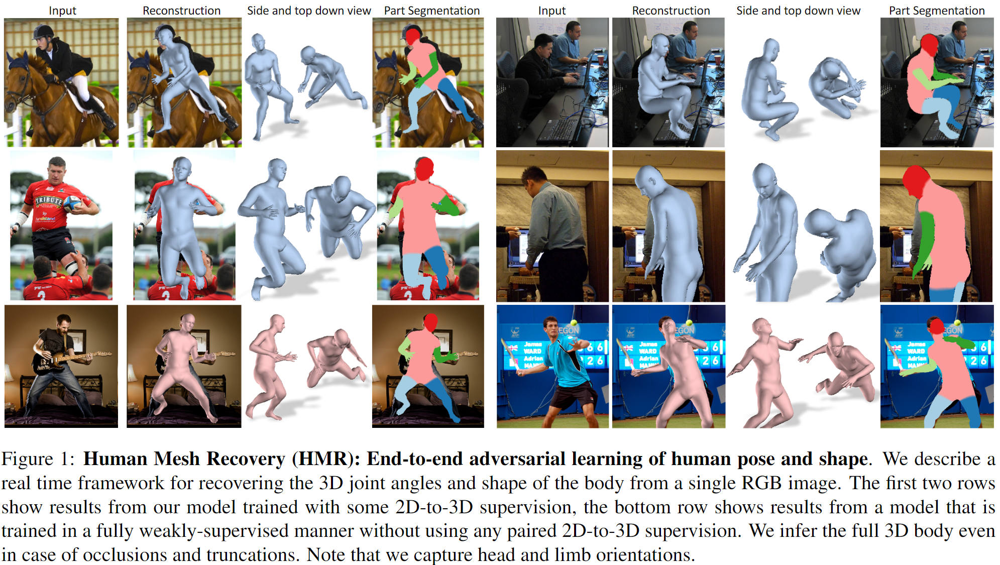
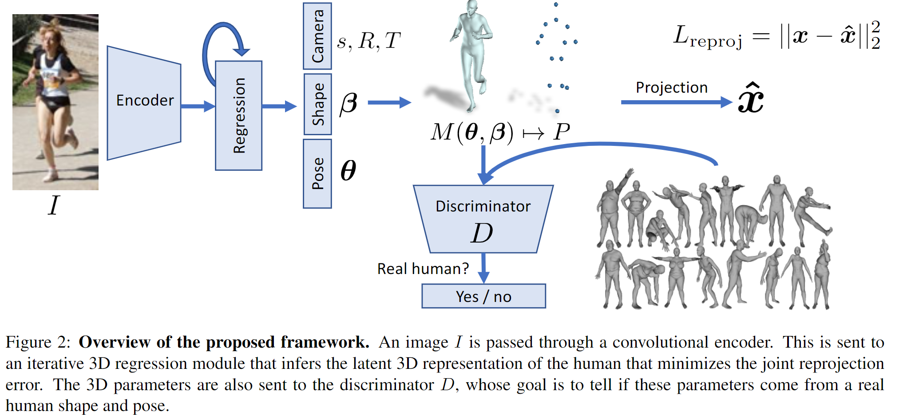

# End-to-end Recovery of Human Shape and Pose学习笔记

时间：2019/2/2

论文来源：[End-to-end Recovery of Human Shape and Pose](https://arxiv.org/pdf/1712.06584)

------

## 一. 主要工作

论文中提出了Human Mesh Recovery（HMR）框架，这个框架提供实时的端对端的从单张RGB image中重建完整的3D mesh的方法

该方法主要是通过最小化3D keypoint的reprojection loss来重建模型。但是，由于单纯的reprojection loss难以收敛，所以引入了一个对抗网络（adversary net）来对预测参数的真实性进行判别。

主要贡献有：

1. 使用single-stage方法，从RGB image 直接推测3D mesh参数
2. 不仅可以预测skeleton，还能输出完整的3D mesh
3. 使用实时的端对端（end-to-end）的训练方式
4. 可以在没有成对的2D-to-3D数据的情况下进行可靠的预测

------

## 二. 具体工作

本方法目的是学习一个从RGB image到3D模型参数的直接映射关系

end-to-end方法面临的挑战：

1. 缺少大规模的对in-the-wild的图片进行3D标注的数据集。现有的数据集包含的场景多样性比较单一，使用这样的数据集训练出来的模型不能很好的适配general的输入
2. 从2D image还原3D信息本身就是具有歧义性的，深度信息难以确定。不同的3D joints可能会有相同的2D projection，因此可能会预测出一些异常的姿态
3. 需要预测相机参数，这会引入额外的scale模糊性
4. SMPL模型的pose参数是用旋转矩阵（rotation matrices）表示的，回归预测旋转矩阵是很困难的

对策：

1. 针对[1]和[2]，使用一个adversary net，利用3D mesh数据集来对预测的3D参数进行判别。因为不需要使用image对应的3D ground truth，所以不需要大规模的in-the-wild数据集；因为已有的数据集中可以学习到合理的3D参数，所以可以甄别不合理的3D预测结果
2. 针对[3]，在预测3D参数的同时预测相机参数，使用预测的相机进行2D projection
3. 针对[4]，使用有反馈的迭代回归方法进行参数优化

因此，框架的总体流程为：

1. 通过CNN得到RGB image的feature map
2. 将feature map输入到iterative 3D regression module，预测3D pose/shape参数和相机参数
3. 将生成的参数输入到adversarial discriminatior network
4. 使用损失函数$L=\lambda(L_{reproj}+\alpha L_{3D})+L_{adv}$进行参数优化，其中$L_{3D}$是可选的，当没有对应的3D 先验数据时，这一项可省略

### 1. 3D body representation

通过预测SMPL模型的pose\shape参数来重建模型，通过预测相机参数来对3D模型进行reprojection

这样，需要预测的参数有：shape $\beta\in R^{10}$ ，pose ​$\theta\in R^{3K}$ ，camera rotation $R\in R^{3\*3}$ ，camera translation $t\in R^{2}$ ，camera scale $s\in R$：
$$
\Theta=\{\beta,\theta,R,t,s\}
$$
使用$Π$来表示正交投影，使用$X(\theta,\beta)$来表示3D joints，则对应的2D reprojection可表示为：
$$
\hat{x}=sΠ(RX({\theta,\beta}))+t
$$

### 2. Iterative 3D Regression with Feedback 

由于待预测的参数$\Theta$中包括旋转矩阵$\theta$，难以通过一次回归得到可靠的预测结果，座椅使用iterative error feedback（IEF）来回归$\Theta$

3D regression module每一次迭代以image feature map $\phi$，上一次迭代的预测参数$\Theta_{t}$为input，输出残差$\Delta\Theta_{t}$ ，然后更新预测参数$\Theta_{t+1}=\Theta_{t}+\Delta\Theta_{t}$

损失函数为：
$$
L=\lambda(L_{reproj}+\alpha L_{3D})+L_{adv}
$$

- $L_{reproj}​$惩罚2D rerojection和2D joints prior之间的区别
- $L_{3D}$使用3D prior数据进行监督，但缺乏这种先验数据时可以略去
- $L_{adv}​$惩罚被判别为假的参数

### 3. Factorized Adversarial Prior 

由于异常的3D pose也可以产生合理的2D projection，所以引入了一个discriminator network $D$ 来判断预测的参数是否符合真实的人体情况。因此，这个discriminator可以作为一个由数据驱动的先验来指导3D参数预测

由于SMPL参数是可分解的，所以可以对shape和pose建立不同的discriminator；此外，由于pose是基于不同的joint的，所以可进一步对不同的joint建立discriminator

综上，在对抗性网络中使用3D数据集学习得到$K+2$个adversarial prior：1个shape+K个joint+1个总体pose。由于每个discriminator需要判别的数据都很小，所以每个子网络都很小，训练就更稳定更高效。

每个discriminator都对对应参数进行判别，这个判别结果就可以帮助训练出正常的3D 参数