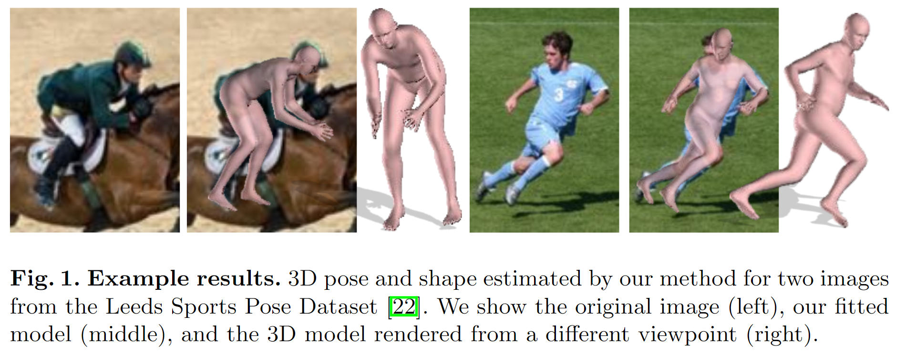
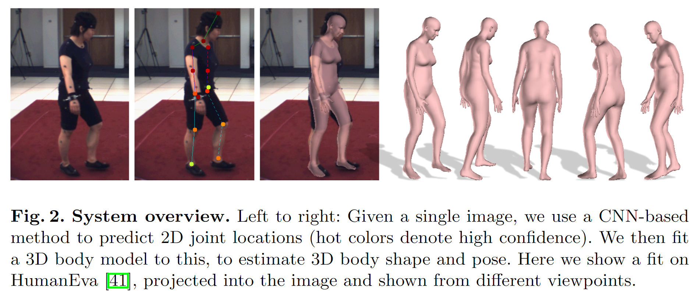
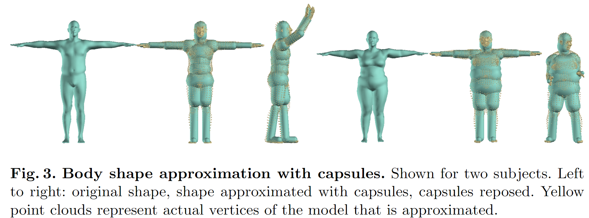
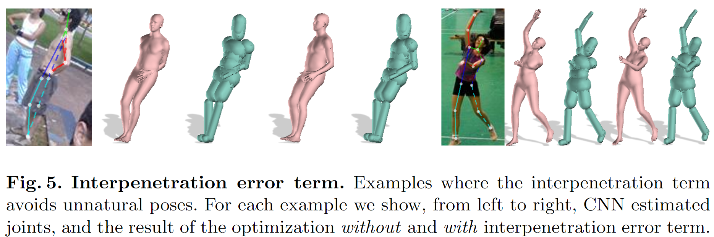

# Keep it SMPL: Automatic Estimation of 3D Human Pose and Shape from a Single Image 学习笔记

时间：2019/1/29

论文来源：[Keep it SMPL: Automatic Estimation of 3D Human Pose and Shape from a Single Image]( https://doi.org/10.1007/978-3-319-46454-1_34)

------

## 一. 主要工作

该论文中提出了一个能自动的从单张图片中估测人物的3D pose和shape的方法——SMPLify（从image到SMPL）。SMPLify使用CNN从图片中预测2D joints位置，然后通过拟合SMPL来近似3D joints的2D投影与预测位置。

这篇论文的主要贡献有：

1. 提出了第一个完全自动的从2D joints估测3D shape/pose的方法
2. 利用一个可微的interpenetration项很好的解决了异常姿态导致的穿模的问题
3. 提出了新的objective function来匹配3D model和2D joints
4. 开源了[SMPLify](http://smplify.is.tue.mpg.de )代码和有关模型

------

## 二. 具体工作

SMPLify的工作流程如下：

1. 使用DeepCut CNN从image中预测2D body joint
2. fit一个SMPL使其3D joint的2D投影位置与预测结果最接近

### 1. 使用Capsules近似body shape

使用模型来预测3D pose时很容易出现“穿模”（interpenetration）的问题，这个问题的产生通常是因为预测的pose是异常的。

直接计算是否存在穿模是很困难的，在图形学中通常使用代理几何表示（proxy geometry）来计算，本篇论文中沿用了这一思路，使用很多胶囊（capsule）来近似SMPL模型形状，通过计算capsules之间的交叉关系来判断是否出现穿模

每个capsule通过半径（radius）和轴长（axis length）来定义，共有20个capsule，分别对应身体的不同部分。

首先，人工将capsule放置到模板模型的joint位置，使用梯度方法优化radius和axis length使capsules和模型表面的双向距离最近。然后,使用cross-validated ridge regression训练一个从shape系数到capsule参数的线性回归器。

单独训练得到这个线性回归器后，就可以直接用在SMPLify过程中，利用shape $\beta$ 得到近似的capsules，然后就可以计算穿模情况了

### 2. Objective Function

用$K$来表示投影相机，$J_{est}$表示CNN预测的2D joints，则目标函数$E(\beta,\theta)$为：
$$
E(\beta,\theta)=E_J(\beta,\theta;K,J_{est})+\lambda_{\theta}E_{\theta}+\lambda_{a}E_{a}+\lambda_{sp}E_{sp}+\lambda_{\beta}E_{\beta}
$$

- $E_J$ 惩罚了投影joints和预测joints的2D含权距离
- $E_a​$ 惩罚了膝盖和手肘出的异常超伸
- $E_{\theta}$ 利用了从数据集中获取的大量先验pose生成高斯混合模型，使用这个混合模型来优化3D pose（剔除很异常的pose）

- $E_{sp}​$ 利用近似的capsules来惩罚穿模现象。基础capsules是$\beta​$ 决定的，再通过$\theta​$旋转之后就能近似不同身体部分的交互情况。通过计算“不兼容”（比如手掌capsule不可能穿过身体capsule）的capsule的交集，就能计算出穿模的情况。最小化$E_{sp}​$ 就能有效避免异常pose的出现
- $E_{\beta}​$利用shape先验来优化预测的shape

### 3. 其他细节

1. 相机的平移位置通过最小化躯干的$E_J$来确定
2. 模型的旋转角度选取在180度范围内对应最小$E_J$的角度
3. fit模型时先使用大的$\lambda_{\beta}$和$\lambda_{\theta}$ ，再逐渐减小
