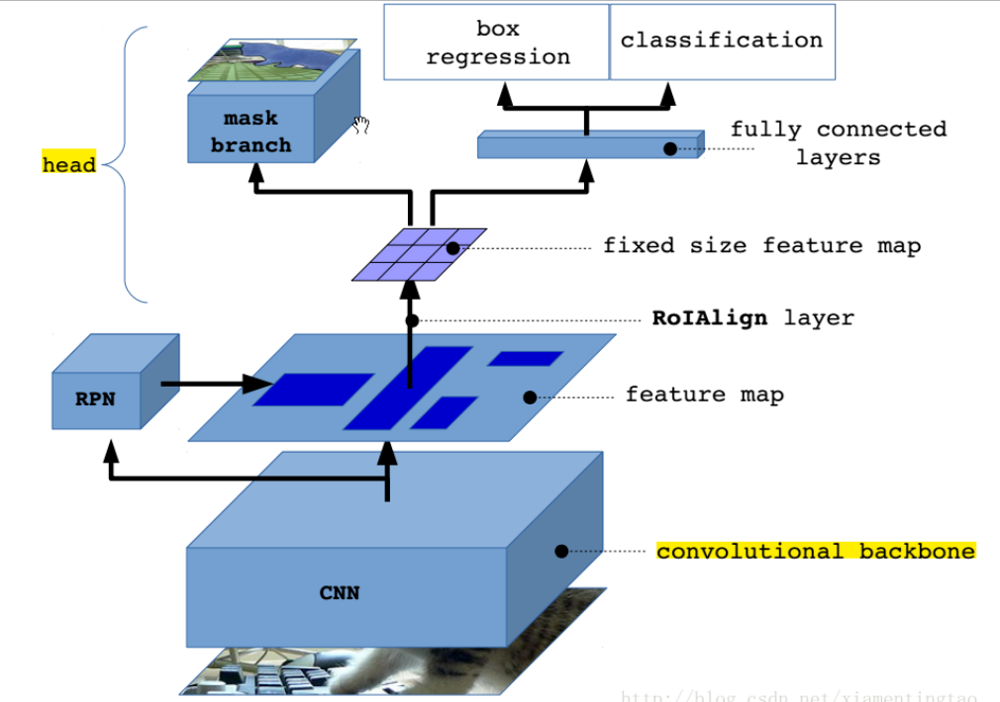
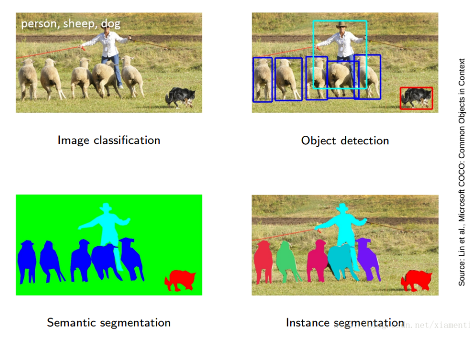
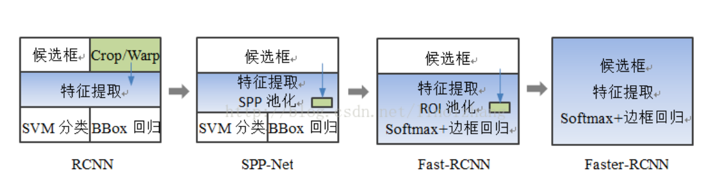
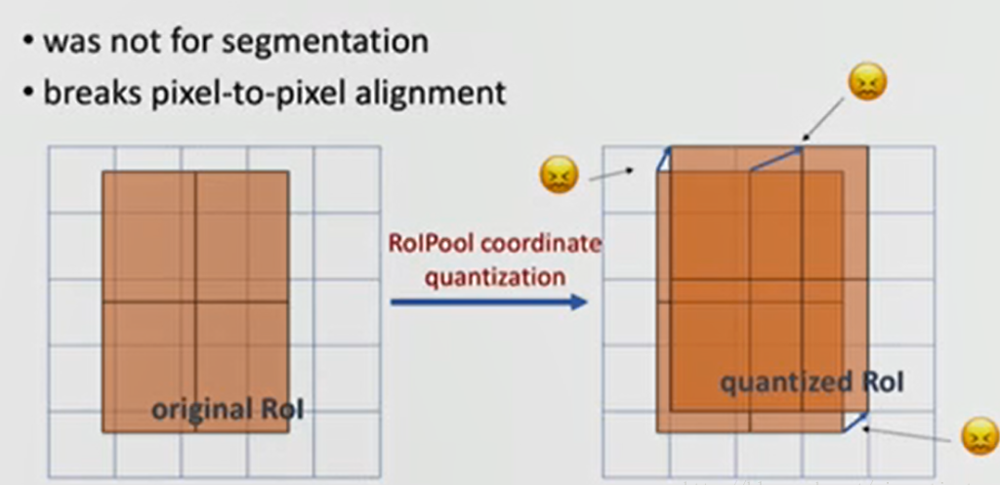
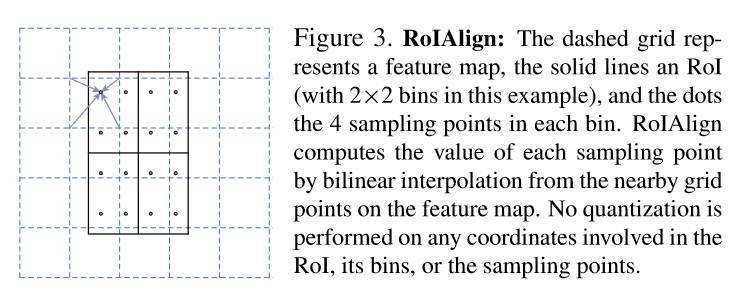
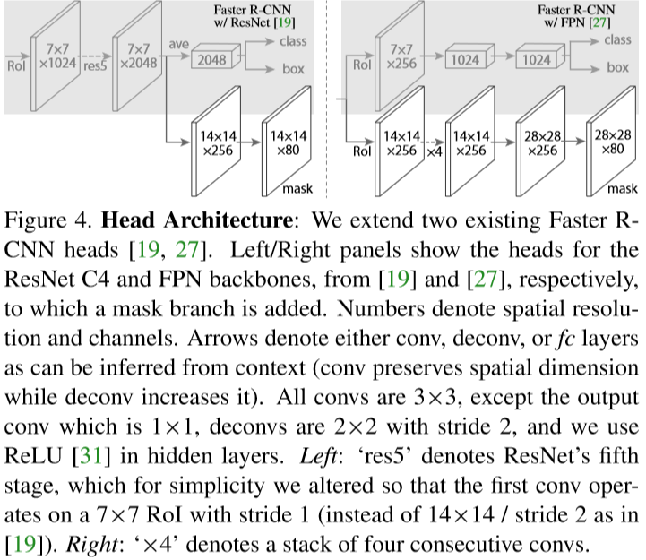
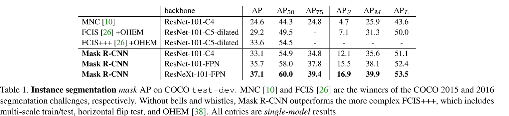

# Mask R-CNN学习笔记

原文链接：[Mask R-CNN](https://arxiv.org/pdf/1703.06870.pdf)

日期：2019/1/17

## 一、主要工作

Mask R-CNN可以看做是对Faster R-CNN的扩展，在原网络的基础上，增加了一个**mask branch**，与现有的classification branch和bounding box branch并行。

对于每一个ROI，mask branch能够高效地检测物体并生成segmentation mask。因此，Mask R-CNN的主要目的是实现**实例分割（instance segmentation）**。

Mask R-CNN 网络结构

------

## 二、相关技术

### 1. Instance Segmentation

首先区分几个概念：

|         概念          |   含义   | 任务                                                       |
| :-------------------: | :------: | :--------------------------------------------------------- |
|   object detection    | 目标检测 | 将图形中的每一个object进行分类，并且用一个bounding box定位 |
| semantic segmentation | 语义分割 | 将图形中的每一个像素划分到已知的某一类别，不区分object实例 |
| instance segmentation | 实例分割 | 正确检测到图像中所有object，并且精确分割每一个实例         |

下图比较直观：

现有的一些instance segmentation网络对比：

| Network                                           | 方法                                                         | 特征                        | 缺点                                                 |
| ------------------------------------------------- | ------------------------------------------------------------ | --------------------------- | ---------------------------------------------------- |
| 早期的method eg.DeepMask                          | 先生成segment候选，然后再使用Fast R-CNN分类                  | segmentation先于recognition | 慢，不准确                                           |
| FCIS（fully convolutional instance segmentation） | 使用全卷积的方法输出大量预测通道，同时处理classification，boxing和mask问题 | 快                          | 对于互相遮盖的实例检测结果不佳，会产生错误的分割边缘 |
| [23,4,3,29]                                       | 先进行语义分割，再把相同category的pixel划分为不同的instance  | segmentation-first          | mask与class prediction之间存在耦合                   |

### 2. R-CNN

R-CNN（Region-based CNN）适用于object detection任务，对于每一个ROI对应的input图像，首先通过CNN处理得到feature map，再分别进行classification和bounding box的回归

Fast R-CNN使用原始input图像得到feature map，然后再使用RoIPooling技术得到不同RoI对应的feature

Faster R-CNN在此基础上，使用RPN（Region Proposal Network ）来提出RoIs

· 参考阅读-[**目标检测-RCNN系列**](https://blog.csdn.net/linolzhang/article/details/54344350)

------

## 三、Mask R-CNN

Mask R-CNN总体上是在Faster R-CNN网络中加入mask branch，细节上主要有以下核心实现：

1. 使用RoIAlign layer来替代RoIPool layer，以获取 pixel-to-pixel 一致性
2. 将mask与class prediction这两个过程进行解耦
3. 调整了Faster R-CNN中的卷积网络骨干架构

### 1. Mask生成

RPN中生成RoIs之后，mask branch与另外两个已有的classification和bounding box branch并行，为每个RoI生成一个二值mask。

mask branch中为每个RoI输出一个维度为$Km^2$的output，其中K代表class数量，m*m是mask的分辨率，相当于每一个RoI在每个class都有一个对应的mask，mask生成与class预测并没有依赖关系。

此外，由于mask是经由FCN生成的m*m的数组，而不像另外两个分支一样经过fc成为了一个特征向量，所以，mask中保持了object的空间信息，比起其他的表示更为准确。

### 2. 损失函数

在原损失函数中加入一项multi-task loss：
$$
L=L_{cls}+L_{box}+L_{mask}
$$
$L_{cls}$ 和 $L_{box}$对应classification和bounding box分支的损失，与Faster R-CNN网络中是一样的。

对于mask branch的output，首先施加per-pixel的sigmoid函数，定义 $L_{mask}$  为平均二叉熵损失（the average binary cross-entropy loss）。并且，对于每个RoI，计算 $L_ {mask}$ 时只考虑与其ground-truch class对应的mask，另外K-1个mask不参与计算损失。

$L_{loss}$允许为每个class都生成mask，只是最后用classification branch的预测label来挑选mask branch的输出，这样就避免了classes之间的竞争，实现了mask和class prediction之间的解耦，利于提高instance segmentation的准确性。

### 3. RoI Align

由于RoI区域的大小与需提取的feature map的大小不一定适配，在Faster R-CNN中使用RoIPool来选取RoI对应的feature，这个过程中存在量化（quantize）的现象：

1. 提取RoI对应的feature map这一过程中，RoI的映射位置通常是浮点数，RoIPool的做法是向下取整，这会造成一定的偏移
2. 得到feature map之后，通常还要使用池化方法（通常是max pooling）进行信息聚合

以上的两个过程，会造成RoI区域的真实feature和RoIPool得到的feature的不匹配，出现misalignment。尽管classification和bounding box分支对这样的误差不敏感，mask分支的准确率则会受到很大影响。

因此，Mask R-CNN提出了用RoIAlign来替换RoIPool，抛弃所有量化过程，直接在原始feature上使用双线性插值法（bilinear interpolation）得到对应feature map的结果：

RoIAlign属于Mask R-CNN的key feature，对于提高实例分割准确性起了重要的作用

### 4. 网络架构

首先，整个网络可以大致上被分成两个部分：

1. 卷积网络骨干（convolutional **backbone** ）部分：用于从整体图像中提取特征。
2. 网络头（network **head** ）部分：包括classification、bounding box regression和mask prediction三个分支。

对于backbone部分，尝试了ResNet和FPN（Feature Pyramid Network）

对于head部分，使用FCN来进行mask预测，对于另外两个branch，根据backbone的不同进行了些许调整

细节见下图：

不同搭配的准确率见下表：

·参考来源：[Mask RCNN笔记](https://blog.csdn.net/xiamentingtao/article/details/78598511)

