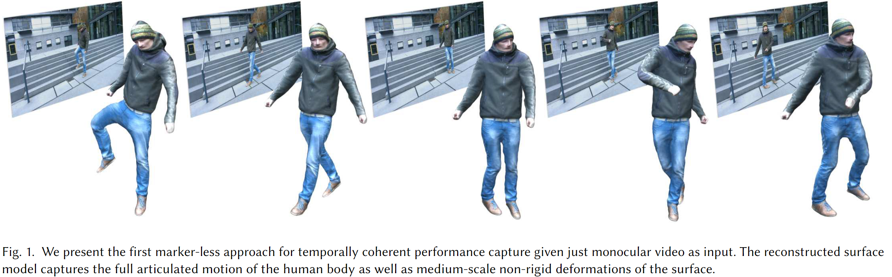
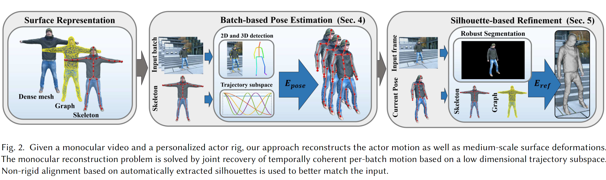
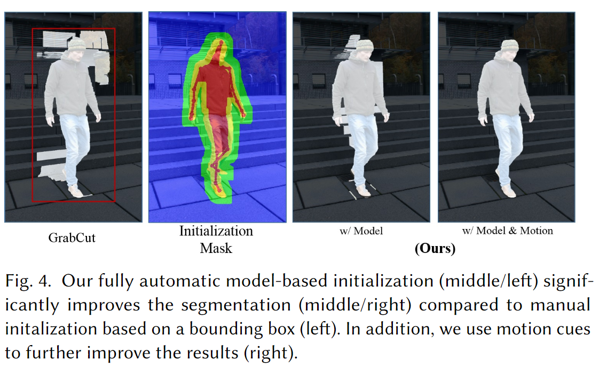
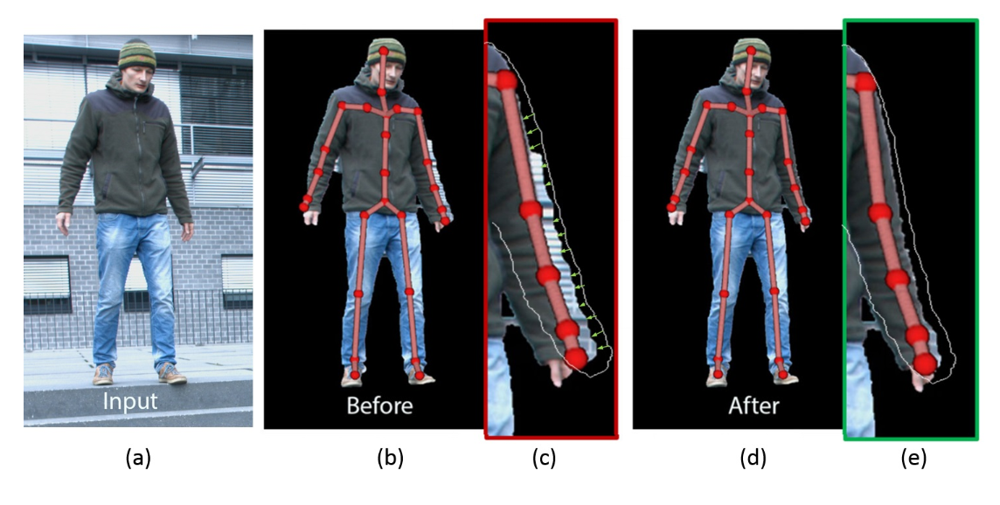

# MonoPerfCap: Human Performance Capture from Monocular Video学习笔记

时间：2019/1/30

论文来源：[MonoPerfCap: Human Performance Capture from Monocular Video](https://doi.org/0000001.0000001_2)

------

## 一. 主要工作

该论文中提出了第一个无标记的从单目视频中捕获包含衣物的人物模型的方法。这一方法重建了由关节组成的人物骨骼和中等尺度的非刚性形变。

主要贡献有：

1. 提出了第一个只依赖单目视频的human 3D performance capture方法
2. 通过结合2D和3D的keypoints检测方法，使用基于批处理的动作优化方式，解决了在单目3D姿态估测任务中固有的关节扭曲（flipping）问题
3. 通过自动提取单目剪影（monocular silhouette）恢复了非刚性的形变信息
4. 创建了一个涵盖了不同场景的约40k帧的基准数据集

------

## 二. 相关技术

### 1. PCK

**关键点正确估计的比例（Percentage of Correct Keypoints，PCK）** 是keypoint detection任务中的一个评价指标，计算检测的关键点与其对应的groundtruth间的归一化距离小于设定阈值的比例

### 2. GrabCut

GrabCut是微软研究院的一个课题，是采用graph cut图分割和最大流技术的一种交互式图像分割技术

------

## 三. 具体工作

| 问题                                                         | 对策                                                |
| ------------------------------------------------------------ | --------------------------------------------------- |
| RGB video中人物的身体部分会存在互相遮挡的问题，但是视频中深度信息是隐式的 | 使用template mesh帮助捕获video中的信息              |
| 人体会产生复杂的关节运动                                   | 定义骨骼变形（skeleton deformation）空间            |
| 皮肤和衣物的变形是非刚性的                                   | 定义非刚性形变（non-rigid surface deformation）空间 |

主要流程如下：

1. 拍摄T-pose的全角度人物视频，使用软件Agisoft Photoscan重建template mesh
2. 输入单目视频，利用CNN检测的2D和3D joints，使用基于批处理的优化方法，预测3D pose
3. 通过自动提取silhouette，对3D pose进行refinement，并恢复模型表面的非刚性形变信息

### 1. 基于批处理的3D human pose估测

人物的关节运动被参数化为一个骨骼（skeleton），有16个joint的skeleton $S= \{t,R,\Theta \}​$ ，其中，$t\in R^3​$ 表征位移，$R\in SO(3)​$ 表征旋转，$\Theta\in R^{27}​$ 表征27个角度。template mesh通过双四元数蒙皮捆绑在这一skeleton上。

video序列被划分成不同的batch，batch之间会出现重合的帧。每个batch都被单独处理，batch内部各帧的skeleton被统一优化。

用$B​$ 表示batch内各帧的skeleton的集合，通过优化$E_{pose}(B)​$ 预测3D pose：
$$
E_{pose}(B)=E_{2d}(B)+w_{3d}E_{3d}(B)+w_{d}E_{d}(B)
$$

- $E_{2d}​$ 惩罚了来自CNN的2D detection和3D pose投影的距离
- $E_{3d}$ 惩罚了来自CNN的3D detection和3D pose的距离，其中$w_{3d}​$ 由每帧的PCK error决定
- $E_d$ 强制batch内的每个skeleton轨迹位于低维线性子空间内，从而确保batch内部pose的连续和光滑

### 2. 基于silhouette的进一步优化

#### （1）自动提取silhouette

从每一帧提取人物silhouette的工作基于GrabCut技术。

原始的GrabCut提取方法需要用户标记一个bounding box来初始化几个$T$ sets，为了实现自动提取，使用skeleton和template投影$R$和$M$来初始化$T$

为了提高分割方法的稳定性，将batch中相邻的颜色梯度变化小的像素分割到同一region

#### （2）对3D pose进行优化

利用silhouette，使用ICP方法对每一帧的skeleton $S_f​$进行进一步优化：
$$
E_{ref}(S_f)=E_{con}(S_f)+w_{stab}E_{stab}(S_f)
$$

- $E_{con}$ 惩罚了3D model的投影边界点与silhouette的对应点的距离
- $E_{stab}$ 确保优化过程中3D pose不会出现过大的变化

优化结束之后，使用优化后的模型再一次提取silhouette，用于下一步的surface重建

#### （3）重建 Non-rigid Surface

为了恢复人体皮肤和衣物的非刚性形变信息，使用一个参数化的deformation graph $D$， 包括$M\approx1000 $ nodes。$D$ 是从template mesh中简化提取得到的，通过对其中的node $i$ 施加平移量$t_i\in R^3$和旋转量$R_i\in R^3$，再通过线性混合蒙皮就可以实现变形

利用优化后的silhouette，使用$E_{surf}​$优化模型表面形状：
$$
E_{surf}(D)=E_{con}(D)+w_{arap}E_{arap}(D)
$$

- $E_{cons}$ 鼓励模型形状与silhouette拟合
- $E_{arap}​$ 正则化非刚性形变，希望形变as-rigid-as-possible

