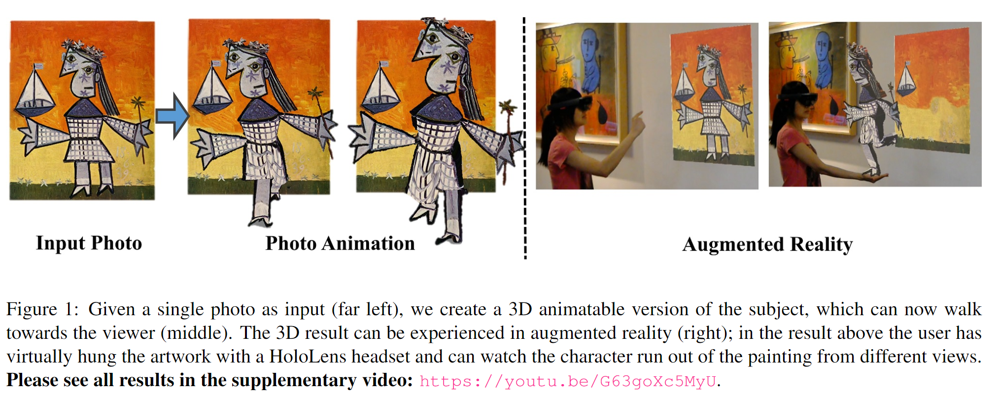
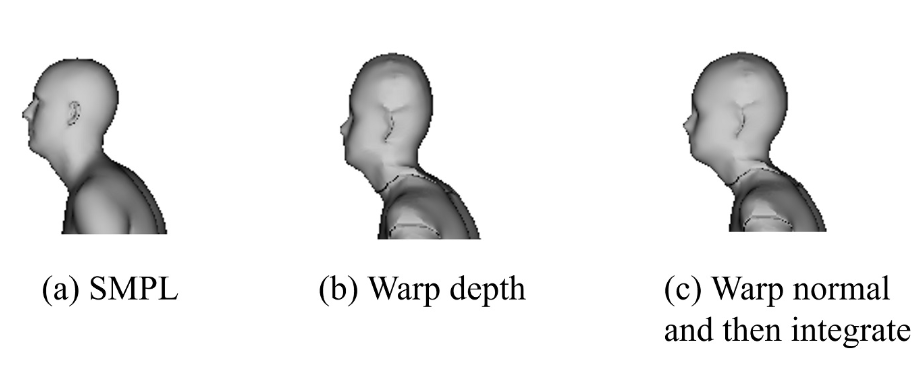
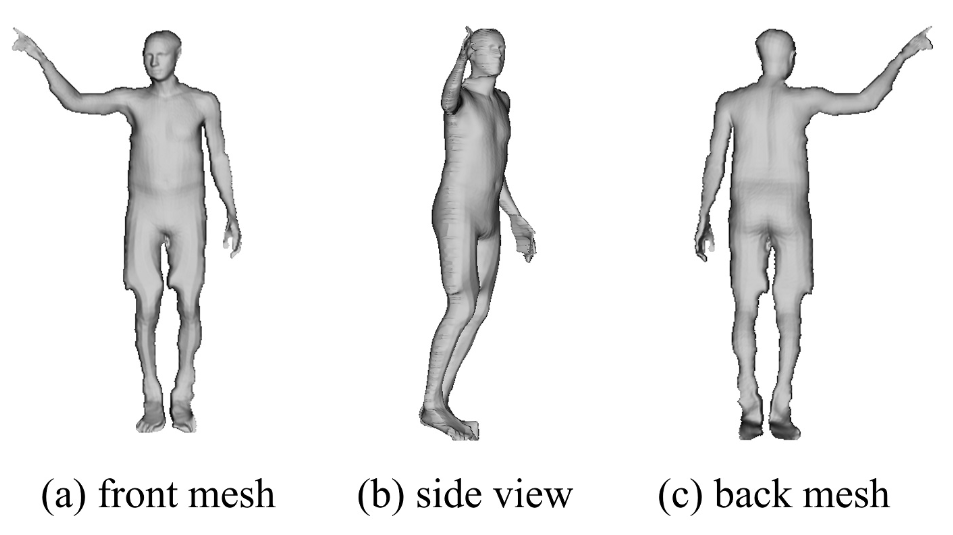
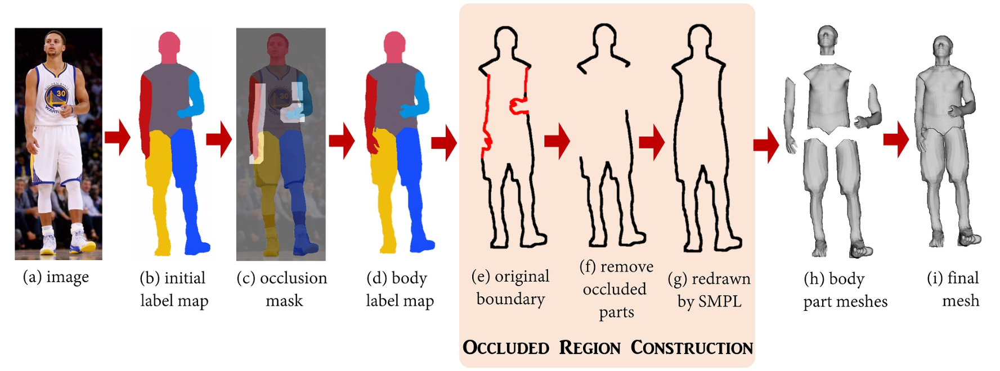

# Photo Wake-Up: 3D Character Animation from a Single Photo学习笔记

时间：2019/1/31

论文来源：[Photo Wake-Up: 3D Character Animation from a Single Photo](https://doi.org/arXiv:1812.02246v1)

------

## 一. 主要工作

该论文提出了从单张图片中重建模型并动画化的方法。

主要工作有：

1. 从单张照片中重建3D的可动画模型，并发布了相关交互应用
2. 提出了更好的对model mesh进行变形的方法，以适配复杂的2D silhouette
3. 提出了人体部分自遮挡问题的解决措施

------

## 二. 基本流程

1. 对single photo中的人物进行识别定位，分割，并预测2D joints
2. 构造有骨骼的可动画模型

## 三. 具体建模过程

有了2D joints就可以利用SMPLify方法得到相应的SMPL模型，但是这样的模型是很原始的，不能体现人物的形状特征，而且与穿着衣物的人体剪影轮廓不匹配。

为了获得高仿真的模型，需要进一步优化SMPL的表面形状，有两种方法：

| 类别      | 方法                                                         | 缺点                                    |
| --------- | ------------------------------------------------------------ | --------------------------------------- |
| 3D method | 直接对SMPL的面片顶点位置进行优化，使SMPL的投影与silhouette匹配 | 在结构复杂的地方（手指etc）优化效果不好 |
| 2D method | 扭曲（warp）SMPL的投影来适配silhouette，然后把这个扭曲函数应用到SMPL的表面法矢和蒙皮函数上 | 论文使用此方法                          |

因为单纯的silhouette无法解决自遮挡（self occlusion）问题，所以对存在自遮挡的照片，还要进行专门的处理

### 1. 无自遮挡建模

用 $S$ 表示照片检测得到的silhouette。

使用SMPLify方法得到初步的SMPL之后，用 $S_{SMPL}$ 表示SMPL投影的silhouette，$Z_{SMPL}$ 表示SMPL投影的深度图像（depth map），$N_{SMPL}$ 表示SMPL的表面法矢（normal map），$W_{SMPL}$ 表示SMPL的蒙皮函数权重（skinning map）

用 $\delta ​$ 表示取边界，在对比$S​$ 和$S_{SMPL}​$ 之后，通过对$Z_{SMPL},N_{SMPL},W_{SMPL}​$施加一个平滑的反向弯曲函数$f(x)​$ ,获得符合照片中人物形状的对应参数$S(x),Z(x),N(x),W(x)​$:
$$
\begin{eqnarray}
S(x)=S_{SMPL}(f(x))\\
Z_{\delta S}(x\in\delta S)=Z_{SMPL}(f(x))\\
N(x)=N_{SMPL}(f(x))\\
Z(x)=Integrate[N;Z_{\delta S}]\\
W(x)=W_{SMPL}(f(x))
\end{eqnarray}
$$
注意不是$Z(x)=Z_{SMPL}(f(x))$ ，因为这样的warping只对模型进行了平面的拉伸，对深度方向没有扭曲，产生的模型就不真实。当$Z(x)$与$N(x)$比较接近时，扭曲效果比较接近真实

选择使用均值坐标（mean-value coordinate）来构造$f(x)​$ ：

用 $p_i\in \delta S = (p_0,p_1,...p_{m-1})​$表示$S​$边界上的点，用$x​$表示$S​$内部的点，用$\lambda_i(x)​$ 表示$x​$关于$p_i​$的均值坐标，则有：
$$
x=\sum_{i=0}^{m-1}\lambda_i(x)p_i
$$
假设$ \delta S ​$和$ \delta S_{SMPL} ​$上的点通过关系$\phi​$来对应匹配，则有：
$$
p_i→p_{\phi[i]}^{SMPL}
$$
根据以上两公式可得$f(x)​$：
$$
f(x)=\sum_{i=0}^{m-1}\lambda_i(x)p_{\phi[i]}^{SMPL}
$$

#### （1）边界匹配$\phi$ 

 $\delta S ​$和$ \delta S_{SMPL} ​$上的点通过关系$\phi​$来对应匹配，$\phi​$通过以下公式进行优化：
$$
arg\min_{\phi[0],...\phi[m-1]}\sum_{i=0}^{m-1}D(p_i,p_{\phi[i]}^{SMPL})+T(\phi[i],\phi[i+1])
$$

- $D​$鼓励$\delta S ​$和$ \delta S_{SMPL} ​$上的对应点坐标距离相近
- $T$惩罚了连续两个对应关系之间的较大跨度

#### （2）Hole-filling

因为$\phi$是$\delta S→\delta S_{SMPL}$的，不是双向映射，所以会出现$\delta S_{SMPL}$上的有些点没有被匹配到，$N(x)$和$W(x)$中的这些hole就需要被补上（具体方法论文中没提到，在supplemental material中有介绍）

#### （3）构造完整的mesh

由于输入的照片是frontal的，还需要补足背面的信息。由于$S_{back}$和$S$是镜像对称的，所以对SMPL进行背面投影，再使用之前的warping方法就可以得到back view的各种对应参数。

各种扭曲后的参数都确定后，就可以构造front mesh和back mesh，再把这两个mesh缝合到一起，就可以构造出完整的高仿真度的模型

------

### 2. 自遮挡建模

当照片中的人物出现自遮挡时，silhouette就不能完全反映人的各部位的shape信息。为了解决这一问题，论文中通过segmentation将人物分成不同的part，先构造partial mesh，然后把不同part对应的mesh连接在一起。

注意论文中主要针对的是手臂对身体替他部分的遮挡。

#### （1）构造Body label map

用$L_{SMPL}$表示对$S_{SMPL}$进行segmentation之后的label map，对比$L_{SMPL}$ ，对$S$构造label map $L_{init}$：
$$
\min_{L_init}\sum_{p\in S}U(L_{init}(p))+\gamma\sum_{p\in S,q\in N(p)\and S}V(L_{init}(p),L_{init}(q))
$$

- $U$鼓励$L_{init}$和$L_{SMPL}$相似
- $V$鼓励label的空间一致性

得到$L_{init}$之后，判断在$S$中相邻的label不同的点在原SMPL模型中是否相邻（如果两个像素2D相邻且分属不同body part，对应的3D模型上的点又不相邻，则说明这两个像素位于自遮挡的边界线上），得到遮挡边界后，对遮挡边界进行膨胀（dilation），就能得到一个occlusion mask $O$

对$L_{init}$中$O$内部的label进行进一步的优化，使原始图片$I$中的颜色不连续性在label中有更好的体现，就可以得到最终的body label map $L$：
$$
\min_{L}\sum_{p\in O}U(L(p))+\gamma\sum_{p\in O,q\in N(p)}V(L(p),L(q))
$$

- $U​$鼓励相同颜色的像素有相同的label
- $V$鼓励label的空间一致性

#### （2）重建occluded region

在得到body part segment之后就要对被遮挡的部分进行shape恢复

首先把头，躯干和双腿当作一个区域 $B$（目的就是恢复手臂对$B$的遮挡），然后提取出这一区域的边界$\delta B$ ，然后进一步得到被遮挡的边界$\delta B^{ocl}\in\delta B\and O$。同时，把SMPL的头，躯干和双腿进行投影，把$\delta B^{ocl}$上的点替换成$\delta B_{SMPL}^{ocl}$上的对应点，这样就对被遮挡的$B^{ocl}$进行了恢复

#### （3）构建完整mesh

不同于之前重建frontal和back两部分mesh，现在要按照segment和恢复的part shape对不同的body part进行warping，构造不同part的mesh。

最后，把part meshes缝合到一起，施加Laplacian平滑函数来减少连接处的不匹配

------

### 3. 其他细节

- **Head pose** ：SMPL的头的位置经常会不太对劲，所以额外对photo进行面部基准点检测，然后利用检测结果对head pose进行调整
- **纹理贴图** ：

1. 被遮挡的区域通常使用PatchMatch来进行纹理补全
2. 背面的纹理有两种生成方式：（1）使用正面纹理的镜像（2）提供交互界面由用户进行指导

------

## 四. 疑问：

均值坐标

为什么自遮挡会有问题