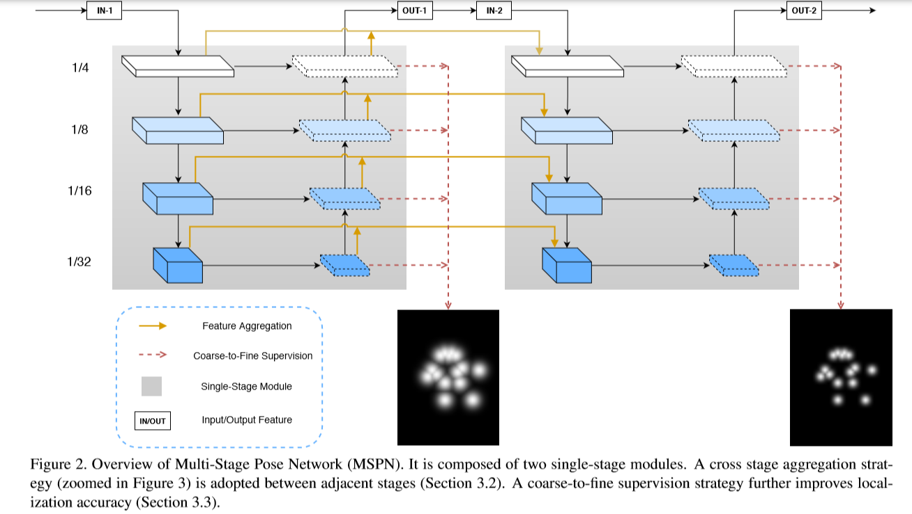
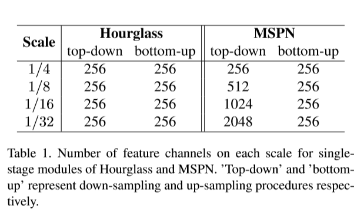
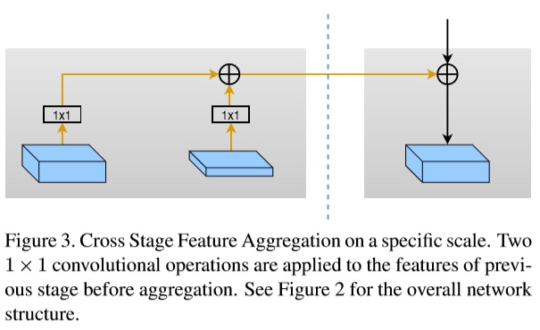

# Rethinking on Multi-Stage Networks for Human Pose Estimation 学习笔记

原文链接：[Rethinking on Multi-Stage Networks for Human Pose Estimation](https://arxiv.org/pdf/1803.09894.pdf)

日期：2019/1/16

------

## 一、概要

现有的HPE（Human Pose Estimation）方法可以被分为两类：single-stage方法和multi-stage方法。尽管理论上multi-state方法应该更适用于HPE问题，因为它可以提供更高的空间分辨率（spatial resolution）、多级监控（multi-level supervision）和由粗到细的精化（coarse-to-fine refinement），可现有的multi-stage方法在COCO数据集上表现并不如意。

该论文研究了这一问题，指出了现有的multi-stage方法在设计上的一些不足之处，并基于观察和前沿技术提出了一个新的模型-MSPN（ multi-stage pose estimation network）

------

## 二、相关技术介绍

### Single-Stage Approach 

single-stage方法主要是基于一些在图像分类问题中表现很好的模型，比如VGG和ResNet。通常是在这样的网络之后加入上采样和反卷积过程来提高深度特征的空间分辨率。

[27]中的网络首先使用Mask R-CNN生成人物框（person box），然后对每个框中的人物单独进行姿势识别，最后生成一个带有相对偏移（relative offset）的heat map来表示对keypoints的预测

[8]使用了一个 Cascade Pyramid Network (CPN)来完善姿势识别过程，其中提出了使用新的loss方法 online hard keypoints mining (OHKM) loss 

single-stage方法的缺陷在于，简单提升模型的计算能力（capacity）并不能带来准确率的提升

#### 疑问：

> The proposed online hard keypoints mining (OHKM) loss is used to deal with hard keypoints. 

什么是hard keypoints？

### Multi-Stage Approach 

multi-stage方法可分为Bottom-up方法和Top-down方法，其中single-stage方法全是Top-down的

#### 1. Bottom-up method

首先识别图像中的所有关节点，然后将这些关节点与人物实例对应

eg. OpenPose

#### 2. Top-down method

首先检测出人物，然后对各人物进行单人姿势识别，得到该人的keypoint位置

#### 3. Hourglass Network

使用全卷积神经网络，对给定的单张RGB图像，输出人体关键点的精确像素位置，使用多尺度特征，捕捉人体各关节点的空间位置信息。网络结构形似沙漏状，重复使用top-down到bottom-up来推断人体的关节点位置。每一个top-down到bottom-up的结构都是一个stacked hourglass模块。对于每一个stacked hourglass模块进行中继监督（ intermediate supervision），与ground truth进行误差计算

许多multi-stage网络都是基于hourglass网络进行优化改进的

参考：[卷积神经网络的网络结构——Hourglass](https://blog.csdn.net/u013841196/article/details/81048237 )

------

## 三、Multi-Stage Pose Network 

### 主要工作

Observation 1：现有的multi-stage方法中的single-stage模块不是最优的，Hourglass网络中down-sampling和up-sampling都使用了相同的channel数目

->Optimization 1：对single-stage 模块进行改进

Observation 2：现有的multi-stage方法中重复进行down-sampling和up-sampling导致信息丢失，从而阻碍了后续的优化

->Optimization 2：集合不同stage 的特征信息来强化信息流

Observation 3：multi-stage方法中pose localization的精确度是随着stage而不断优化精确的

->Optimization 3：使用由粗到细的监督方法，对不同的stage采用不同的监督粒度

### Optimization 1. Effective Design of Single-Stage Module

**问题**：Hourglass网络的每一个stacked hourglass模块中，每次down-sampling和up-sampling的channel数目都一样，这就导致low scale的层级中损失了大量的特征信息

**对策**：

1. 每一次down-sampling都把channel数乘2，从而减少信息损失
2. 把计算资源主要投入到down-sampling过程中。因为down-sampling过程提取出有代表性的特征信息，对整体识别很关键。而up-sampling过程主要用于恢复高分辨率，对损失信息恢复起不到太大作用，重要性不及down-sampling过程       

### Optimization 2. Cross Stage Feature Aggregation

**问题**：每一个stage都有down-sampling和up-sampling的过程，multi-stage方法中这样的反复采样会导致信息损失

**对策**：在每一次down-sampling过程中，集合来自**上一stage的同scale的 down-sampling** 和**up-sampling units** 的特征信息，以及**本stage的 down-sampled features** 

通过集合不同stage的特征信息，来弥补采样过程中的信息丢失，解决优化过程中梯度消失的问题，这一过程可以类比残差网络的设计     

 

### Optimization 3. Coarse-to-fine Supervision

**现象**：

1. 在对一些关节点不可见的challenging pose进行识别时，context信息对于定位非常重要
2. 在HPE问题中，一些小的定位错误会对整体的姿势识别结果造成巨大影响
3. 作为监督标准的ground truth heatmap的粒度随stage增加，是由粗到细的

**对策**：

1. 对于不同的stage，使用不同的size的Gaussian kernel来生成heatmap，stage越靠前，kernel size越大。这样在监督时，不同stage生成的heatmap就与对应尺度的ground truth进行误差计算
2. 对每一个stacked hourglass模块中的不同scale的sample，都进行中继监督，从而获取大量的context信息，利于challenging pose的定位
