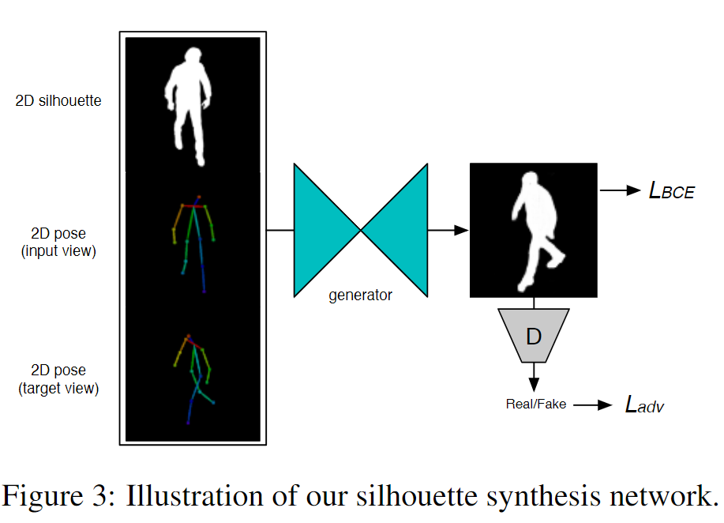

# SiCloPe: Silhouette-Based Clothed People 学习笔记

日期：2019/1/24

论文来源：[SiCloPe: Silhouette-Based Clothed People]( https://arxiv.org/pdf/1901.00049v1.pdf)

------

## 一. 主要工作

该论文中提出了从单张正面视角图片重建包含纹理贴图的有衣物的3D人物模型的方法。该方法基于剪影图片（silhouette）和深度学习技术，不需要模型模板。


该方法的主要创新之处有：

1. 提出了第一个非参量的（non-parametric）从单一视角图片（single-view image）中重建包含完整纹理（fully textured）的有衣物的3D人体模型（clothed 3D human）
2. 提出了一个两阶段（two-stage）的3D重建流水线，包括（1）根据单视角剪影预测多视角剪影，和（2）进行了视角采样优化的基于可见外壳的网格重建技术
3. 提出了一个image-to-image的转换框架来从单张图片中重建全面的纹理贴图


## 二. 相关技术

### 1. Visual hull

visual hull （可见外壳、可视外壳）是由A. Laurentini. 引入的由形状到轮廓的3D重建技术构建的几何实体。

原始图像可以经过阈值化为二值图像，这种图像称作剪影（silhouette image）。当利用相机的透视投影的方式将剪影投影到3D空间时，将得到一个剪影形状的锥体（silhouette cone）.不同视角的剪影经过投影得到的锥体相交产生一个包含该物体的凸包,这个凸包就是物体的可见外壳

基于visual hull的重建方法有很多，但是基础的visual hull方法不能很好地体现细节特征，当剪影视角不够丰富时缺陷更明显


### 2.Single-view reconstruction

· 单视角重建的困难之处：

1. 人物本身的身材形状，衣物，外观具有复杂性，单一图片难以覆盖所有信息
2. 从单一视角难以生成整体的纹理贴图
3. 难以从单视角数据预测整体的几何信息
4. 需要大量的训练数据和大量的参数训练过程

· **核心任务**：从单一视角的输入数据中推测多视角的信息


------

## 三. 主要方法

重建主要分为三个步骤：

1. 根据input图片提取出2D的剪影图片和3D的关节点位置，使用一个silhouette synthesis网络推测不同视角的2D剪影图片
2. 利用多视角的剪影图片，使用一个贪心的视角采样方法生成visual hull，对3D模型进行重建
3. 使用一个image-to-image的转化网络，利用输入的正面图片推测出背面图片，生成全面的纹理贴图


### 1. Multi-View Silhouette Synthesis 



提出了一个通用的剪影合成网络$G_s$，使用当前视角的source silhouette image，对3D joints在当前视角和目标视角投影获得的source pose和target pose，生成目标视角的target silhouette image：
$$
S_t = G_s(S_s,P_s,P_t)
$$
损失函数包括二阶交叉熵损失$L_{BCE}$和对抗性损失$L_{adv}$:
$$
L = \lambda_{BCE}L_{BCE}+L_{adv}
$$
注意到对抗性损失对推测处的图像的清晰度和细节的表现力有很大影响


### 2. Deep Visual Hull Prediction


尽管得到了新的视角的剪影图片，但是推测得到的结果和input中得到的3D joints不一定匹配。使用不匹配的剪影图片建模时，visual hull就会缩减当前视角中不匹配的部分，导致最终生成的visual hull被过度侵蚀。

因此，采用了一个贪心算法来选取视角匹配的剪影：

```
# 生成candidate viewpoint
首先，在以y轴为旋转轴的方向，等距选取12个角度，其中第一个就是input image的视角
对于其他的11个角度，每个设置5个备选俯仰角度{0，15，30，45，60}
这样除了input视角外，就有11*5个备选视角

# 用贪心算法选取最合适的viewpoint
根据3D joints生成一个bounding volume H[0]
使用input image的silhouette对H[0]进行雕刻（carve），得到H[1]
for i=2 to 12:	# 11个水平旋转角度
	for j=1 to 5:	# 5个备选俯仰角度
		计算H[i-1]的投影与角度ij下的silhouette的IoU（intersection over union）
	end for
	使用IoU最大的viewpoint对应的silhouette对H[i-1]进行雕刻，得到H[i]
end for

H[12]就是选取最匹配的silhouette生成的visual hull	
```

以上只是一个简易的表示，实际的deep visual hull network中还利用了2D的pose投影信息作为辅助的语义信息，从而提高整个网络的稳定性


### 3. Front-to-Back Texture Synthesis


观察发现正面视角和背面视角下的人物的轮廓信息和一些特征是共享的，因此提出了基于conditional generative adversarial network的image-to-image的转换网络，输入正面的image和剪影，推测对应的背面图片，从而生成全面的纹理贴图：
$$
I_{back} = G_t(I_{front}, S_{front})
$$
损失函数包括特征匹配损失，分类网络VGG19的感知损失和对抗损失：
$$
L=\lambda_{FM}L_{FM}+\lambda_{VGG}L_{VGG}+L_{adv}
$$


------


四.疑问

什么是对抗性损失？