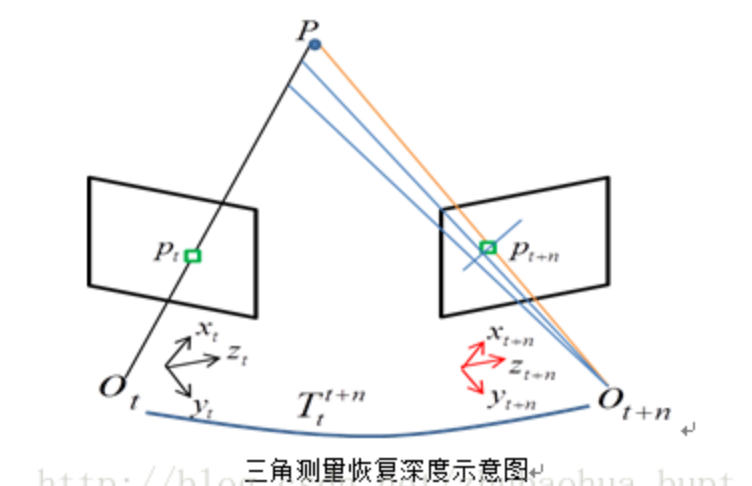
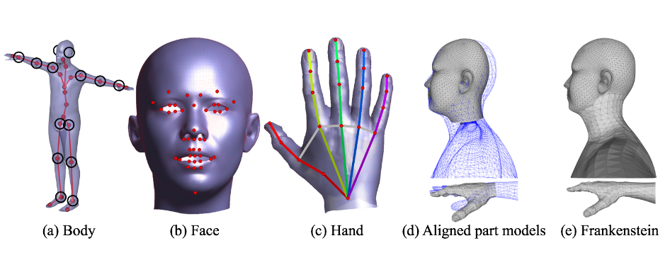
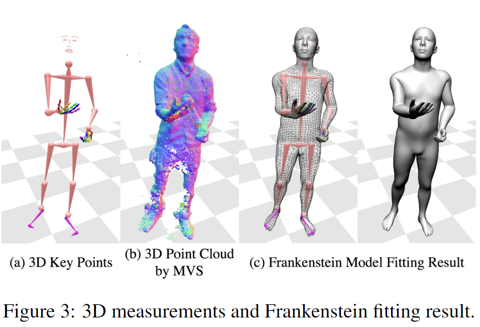
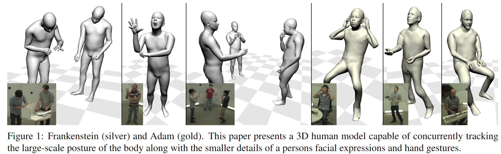

# Total Capture: A 3D Deformation Model for Tracking Faces, Hands, and Bodies学习笔记

日期：2019/1/25

论文来源：[Total Capture: A 3D Deformation Model for Tracking Faces, Hands, and Bodies]( https://doi.org/10.1109/CVPR.2018.00868)

------

## 一. 主要工作

该论文提出了一个统一的可变形的模型，该模型基于无标记（markerless）的输入数据，能够捕获不同尺度（面部表情，身体运动，手势）的人体动作信息。

要想捕获这些动作信息，最**核心的挑战**是身体的不同部分的尺度（scale）不同，重建尺度较小的部分就需要更高分辨率的近距离特征捕获，重建大尺度的部分就只需要大范围的整体覆盖。

为了解决这样的问题，论文中提出了**两个主要方法**：

1. 利用多视角的2D关键点检测技术获取3D关键点信息，这样的信息在人物交互中是robust的
2. 为了补偿传感器分辨率的局限性，提出了新的一般性的body deformation模型，这样的模型可以表现身体的主要部分的运动。模型包括initial的Frankenstein模型，和optimized的能表现头发和衣物形状的Adam模型

------

## 二. 相关技术

### 1. Motion Capture

运动捕捉系统主要有两种方法，一种是**基于反光标记（retro-reflective markers）**的，另一种是**无标记（markerless）**的。

基于标记的捕捉方法由于其高准确性被广泛使用，但是这样的方法具有一些缺点：

1. 为了捕捉的准确性就需要一定数量和密度的marker，但是大量的marker会影响测量结果的空间分辨率
2. 当动作导致marker之间相互遮挡时，标记方法难以自动的处理遮挡问题，有时候就需要人工处理，这样的操作成本很高，并且限制了对手部动作的捕捉（手部很互相遮挡）

由于keypoints detection技术的不断成熟，markerless的方法可以通过这项技术来提高动作捕捉的精度，并且处理遮挡问题。但是，现有的markerless方法只能集中在单一尺度的某个身体部分（面部，身体，手），无法进行整体的运动捕获。

由于人的身体语言是通过全身各个部分的动作共同表示的，需要进行整体的动作捕捉才能更好的感知身体语言信息，所以，该篇论文尝试提出了统一的包含不同尺度的动作捕捉方法

### 2. ICP算法

**迭代最近点（Iterative Closest Point ，ICP）算法**能够使不同的坐标下的点云数据合并到同一个坐标系统中。ICP算法本质上是基于最小二乘法的最优配准方法。该算法重复进行选择对应关系点对， 计算最优刚体变换，直到满足正确配准的收敛精度要求。

假设给两个三维点集 X1 和 X2，ICP方法的配准步骤如下：

1. 计算X2中的每一个点在X1点集中的对应近点（距离最近的两点形成匹配关系，有的时候会设置一个阈值，抛弃距离过大的匹配）
2. 求得使上述对应点对平均距离最小的刚体变换，得到平移参数和旋转参数；
3. 对X2使用上一步求得的平移和旋转参数，得到新的变换点集；
4. 如果新的变换点集与参考点集满足两点集的平均距离小于某一给定阈值，则停止迭代计算，否则新的变换点集作为新的X2继续迭代，直到达到目标函数的要求。

### 3. Triangulating 

**三角化方法（Triangulating）**是一种恢复深度信息的方法。三角化最早由高斯提出，并应用于测量学中。简单来讲就是：在不同的位置观测同一个三维点P(x, y, z)，已知在不同位置处观察到的三维点的二维投影点X1(x1, y1), X2(x2, y2)，利用三角关系，恢复出三维点的深度信息z。

3D重建时，可以使用三角化方法，通过匹配像素对来恢复像素的深度信息。

### 4. PCA

**主成分分析方法(principal Component Analysis，PCA)**是一种使用最广泛的**数据压缩**算法。

PCA中，数据从原来的坐标系转换到新的坐标系，由数据本身决定。转换坐标系时，以方差最大的方向作为坐标轴方向，因为数据的最大方差给出了数据的最重要的信息。第一个新坐标轴选择的是原始数据中方差最大的方法，第二个新坐标轴选择的是与第一个新坐标轴正交且方差次大的方向。重复该过程，重复次数为原始数据的特征维数。

通过这种方式获得的新的坐标系，大部分方差都包含在前面几个坐标轴中，后面的坐标轴所含的方差几乎为0。于是，可以忽略余下的坐标轴，只保留前面的几个含有绝大部分方差的坐标轴。事实上，这样也就相当于只保留包含绝大部分方差的维度特征，而忽略包含方差几乎为0的特征维度，也就实现了**对数据特征的降维处理**。

### 5. Optical Flow

**光流（Optical Flow）**的概念是Gibson在1950年首先提出来的。它是空间运动物体在观察成像平面上的像素运动的瞬时速度，是利用图像序列中像素在时间域上的变化以及相邻帧之间的相关性来找到上一帧跟当前帧之间存在的对应关系，从而计算出相邻帧之间物体的运动信息的一种方法。一般而言，光流是由于场景中前景目标本身的移动、相机的运动，或者两者的共同运动所产生的。

当人的眼睛观察运动物体时，物体的景象在人眼的视网膜上形成一系列连续变化的图像，这一系列连续变化的信息不断“流过”视网膜（即图像平面），好像一种光的“流”，故称之为光流（optical flow）。光流表达了图像的变化，由于它包含了目标运动的信息，因此可被观察者用来确定目标的运动情况。  

------

## 三. Frankenstein模型

Frankenstein模型主要是（1）利用SMPL捕获身体运动，（2）利用FaceWarehouse捕获面部表情，（3）利用一个手部的骨骼捕获手的运动。然后，把这些不同尺度的模型适当地合并在一起，在保留各模块的原始参数的前提下，合成一个single skeleton的统一模型，来表征人物特征和运动信息

Frankenstein模型$M^U$通过motion参数$\theta^U$，shape参数$\phi^U$，和global translation参数$t^U​$表示：
$$
V^U=M^U(\theta^U,\phi^U,t^U)
$$
整个模型由body，face，left/right hand共4个模型连接而成：
$$
V^U=C[(V^B)^T(V^F)^T(V^{LH})^T(V^{RH})^T]^T
$$
C是blending matirx，合成的模型的顶点数小于部分模型顶点数之和（SMPL中的hands被舍去），合成模型有一个统一的骨骼结构，参数优化也是在unified空间进行的

**局部模型介绍：**

- 身体部分使用SMPL模型，但是只用到了21个keypoints，忽略了两只手的部分，并且template没有使用pose-blend shape，只保留了shape-blend shape。
- 面部使用FaceWarehouse数据集生成了一个PCA模型
- 手部使用一个人工进行骨骼绑定的模型，有16个关节，通过scale参数调整不同手指的尺寸，通过linear transform移动关节点的位置

在合成模型时，以SMPL为基础，给另外的部分模型施加transforamtion matrix $\Gamma$，$\Gamma$与目标关节点位置（head，left/right hand）和body shape有关，可以把部分模型转换到在SMPL中的对应位置上

------

## 四. 使用Frankenstein进行动作捕捉

得到合成的Frankenstein模型之后，就要根据input data对模型的动作和形状进行优化：

1. 使用3D的keypoints信息对pose进行fit；
2. 使用3D点云对shape进行fit

### 1. 3D Measurements

**3D keypoints：** 身体，面部和手的2Dkeypoints可以通过OpenPose框架得到，然后使用[28]中的方法恢复3D的身体骨骼，使用三角化方法（triangulating）恢复手和面部的深度信息；作者们另外训练了一个针对脚部的keypoint detector，在脚部定位了3个keypoint，利用[54]的方法获得了脚部的3D信息

**3D point clouds：** 使用软件Capturing Reality从多视角图像中获得3D点云

### 2. Objective function

损失函数定义如下：
$$
E(\theta^U,\phi^U,t^U)=E_{keypoints}+E_{icp}+E_{seam}+E_{prior}
$$
$E_{keypoints}$促使模型keypoints和3D keypoints匹配；$E_{icp}$通过ICP算法使模型shape和3D点云匹配；$E_{seam}$惩罚在模型连接处的顶点之间的差别，防止连接处尺度差异造成畸形；$E_{prior}$惩罚了3D点云在头发和衣服处的形状对拟合的负面影响（现有的模型不能拟合这些特征）

### 3. Optimization Procedure 

由于合成的模型的待优化参数是属于部分模型的，整体的优化是一个非线性的过程，而且整体骨骼的自由度首先，所以为了避免优化陷入局部最小值，整个优化过程被分成了几个阶段：

1. 使用躯干的4个keypoint先进行优化，确定整体的位移和旋转量，这个过程中prior的权重较大
2. 使用所有keypoints进行优化，拟合pose信息，这个过程中prior的权重较小
3. 使用ICP方法根据3D点云优化shape，这个过程重复2次

------

## 五. Adam 模型

Adam模型基于Frankenstein模型，使用统一的姿态和形状参数替代之前部分模型各自的姿态和形状参数，最后实现了有头发和衣物细节的模型

### 1. 优化内容

#### （1）优化了joints的回归函数

由于OpenPose识别的keypoints和SMPL的keypoints之间存在不匹配，就选用了70个Frankenstein重建数据重新调整了$E_{keypoints}$中模型keypoints的回归矩阵，相当于改变了想要拟合的target keypoints的位置

#### （2）为每个顶点新增了一项标量位移

这一位移补偿了模型和3D点云之间的差别，方向沿顶点的法矢方向，恢复了头发和衣物的信息

#### （3）使用统一的shape和pose参数表征模型特征和动作

在（2）之后，把每一帧模型恢复成rest pose，使用PCA分析构造了一个linear shape space，描述包含了各个部分的整体的shape和pose（注意不包含面部，因为3D点云无法恢复面部细节，面部必须单独优化）

### 2. 优化过程

由于现在采用的是统一参数，所以损失函数中少了$E_{seam}$:
$$
E(\theta^U,\phi^U,t^U)=E_{keypoints}+E_{icp}+E_{prior}
$$
此外，由于Adam是独立地优化每帧模型，虽然可以高并发，但可能会造成连续帧的模型之间出现明显差异。

因此，采用了Optical Flow Propagation方法，优化k帧模型时，使用optical flow产生k-1帧和k+1帧的candidate模型。这样最终每一帧就有3个candidate模型，利用这3个模型优化获得compromise模型，就不会出现较大差异。

------

## 疑问：

什么是PCA模型？PCA到底做了什么工作，有什么意义？