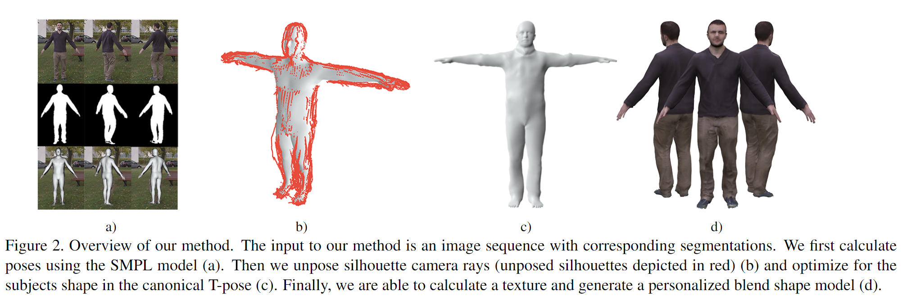
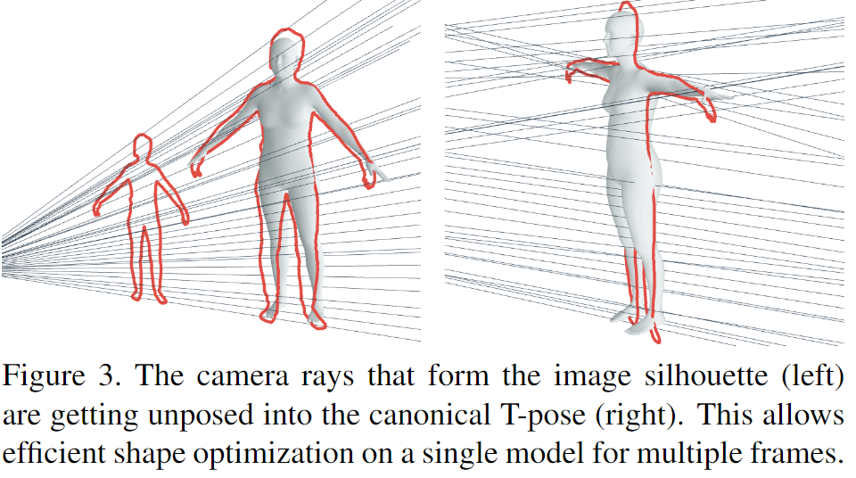
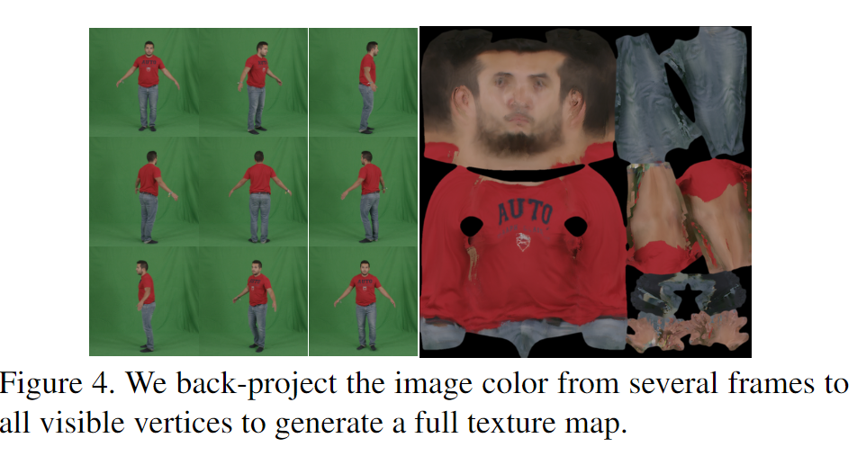

# Video Based Reconstruction of 3D People Models学习笔记

日期：2019/1/22

论文来源：[Video Based Reconstruction of 3D People Models](https://arxiv.org/pdf/1803.04758.pdf)

------

## 一. 主要工作

该论文提出了一种从单目的人物移动视频中生成精准的3D模型及纹理贴图的方法。

该方法基于SMPL模型，主要工作是把多帧画面中人物的剪影锥（silhouette cones）转化成一个可见外壳（visual hull），通过不断优化使SMPL去近似这个外壳，从而获得精准的人物模型。

已有的方法的比较：

| Method                                                       | 缺点                                                         |
| ------------------------------------------------------------ | ------------------------------------------------------------ |
| multi-view passive reconstruction from a dense set of static body pose images | 需要目标人物保持长时间静止，因为姿态变化会影响重建正确性，所以很耗时而且很容易出错 |
| 使用RGB-D相机捕获深度信息                                    | 需要特殊的传感器，不像普通视频一样具有普适性                 |
| -                                                            | 只有形状和纹理，没有骨骼，无法用于动画                       |
| 通过单张图片推测形状参数                                     | 重建被限制在参数空间，无法捕捉特殊的人物斜街和衣物的几何特征 |
| -                                                            | 很多重建方法生成的都是裸体模型，对衣物没有刻画               |

------

## 二. Shape Reconstruction

对于人体的Shape Reconstruction方法主要根据两个标准来进行分类：

1. 用到的传感器的类型
2. 用到的先验模板（template prior）的类型

Reconstruction方法主要可以分为两类：自由形式的（Free-form）和基于模型的（Model-based）

| 类别     | Free-form                                                    | Model-based                                                  |
| -------- | ------------------------------------------------------------ | ------------------------------------------------------------ |
| 特征     | 通过mesh变形或者使用体表示形状（volumetric representation of shape）来重建人体，不需要先验数据 | 使用参数化的模型作为基本模板，通过训练调整参数来表现不同的人物特征 |
| 数据来源 | 通常使用多视角相机，深度相机或者混合传感器                   | 单目相机，视频，图片等信息量较少的数据                       |
| 优点     | 有灵活性                                                     | 对input的要求较低                                            |
| 缺点     | 1. 需要高质量的多角度的input数据，操作难度大 2. 只能模拟慢速和细小的动作移动 | 需要适用的参数化人体模型                                     |

------

## 三. 具体方法

### 1.  对SMPL添加参数

原始的SMPL中的rest-pose模板T为：
$$
T(\beta,\theta) = \bar{T}+B_S(\beta)+B_P({\theta})
$$
T为平均模板，shape-blend shape和pose-blend shape的加和

为了更好地表现衣物的形状和人物的细节，添加了一个辅助变量$D\in R^{3N}$:
$$
T(\beta,\theta,D) = \bar{T}+B_S(\beta)+B_P({\theta})+D
$$
D在训练过程的step2中被优化

### 2. 姿态重建 - step1

使用视频中每帧的人物剪影进行姿态重建：

1. 先使用小数目的几帧（实际使用的是5帧）进行预初始化，目的是调整模型的scale，得到一个相对原始的形状参数$\beta_0$

2. 通过优化剪影项（silhouette term）使3D模型的2D投影与视频中的人物剪影拟合，从而还原视频中人物的姿态
   $$
   E_{silh}(\theta)=G(w_oI_{rn}(\theta)C+w_i(1-I_{rn}(\theta))\bar{C})
   $$
   

3. 使用2D的关节点识别结果和先验的A-pose模型帮助姿态重建

4. 优化每一帧时以上一帧的结果为基础，目的是获得更好的temporal smoothness

**· output：多帧的pose参数集合${\{\theta_p\}}_{p=1}^F$**

### 3. 获取consensus shape - step2

由于每一帧的pose都不同，如果使用一个shape去匹配不同的pose就需要存储很多中间结果，优化过程也很复杂。所以要先把所有pose都unpose成T-pose（$\theta=0$）的状态，这样后续就是用一个shape去匹配很多个T-pose，优化难度和准确度都得到了提升

过程：

1. 使用silhouette图像生成对应的rays cone
2. 为每一个ray找到最近的vertex，使用与该vertex有关的具体参数把ray转化到unposed space，得到T-pose的rays cone
3. 优化shape参数$\beta​$和新增的辅助偏移量D：

$$
E_{cons}=E_{data}+w_{lp}E_{lp}+w_{var}E_{var}+w_{sym}E_{sym}
$$

其中，$E_{data}$惩罚了vertex和对应ray的点线距离，另外几项分别用来确保模型的光滑度，与base模型的相似性和人体对称性

**· output：shape参数$\beta$和新增的辅助偏移量D：**

### 4. 生成纹理图片 - step 3

读取视频来生成纹理图片

1. 将每一帧的模型设置成视频中的pose
2. 把图像颜色投影到可见的顶点上
3. 通过计算所有视图中最正交的纹素的中值，生成纹理图像