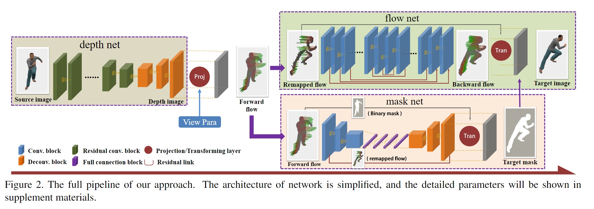
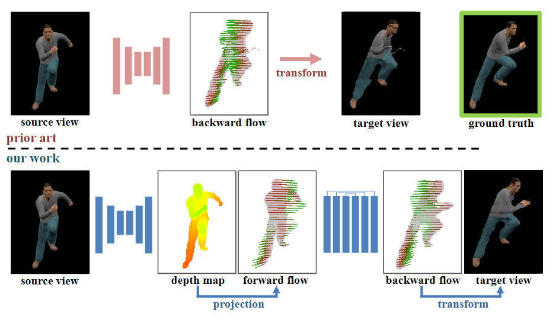
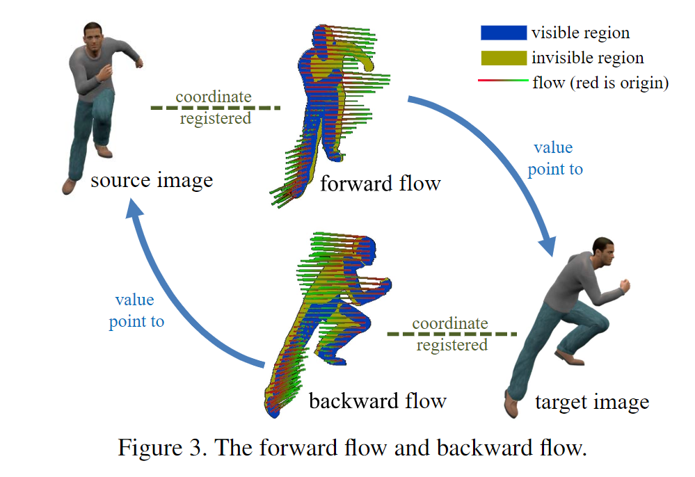
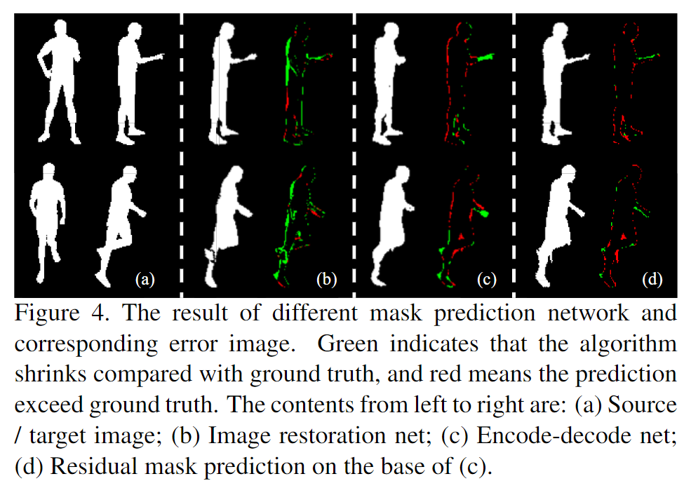

# View Extrapolation of Human Body from a Single Image学习笔记

时间：2019/1/28

论文来源：[View Extrapolation of Human Body from a Single Image]( https://doi.org/10.1109/CVPR.2018.00468)

------

## 一. 主要工作

本篇论文中提出了一个基于深度学习的流水线框架，用于从单张图片中合成新视角的人体图片。

主要工作如下：

1. 提出了一个 **appearance - shape - flow** 的合成策略
2. 将CNN和几何投影信息进行了结合
3. 创建了一个适用于view synthesis任务的高质量的数据集

------

## 二. 相关技术

### 1. View Synthesis task

View Synthesis任务主要有三类解决方法：基于3D模型的，基于2D流（Flow）的和利用生成网络直接生成的

| 分类     | 3D Modeling                                                  | 2D Flow                                                      | Direct Image Generation          |
| -------- | ------------------------------------------------------------ | ------------------------------------------------------------ | -------------------------------- |
| 基本方式 | 先生成3D模型，再把模型投影到target view                      | 估计从source view到target view的像素之间的对应关系           | 通过CNN直接预测target view的图像 |
| 缺点     | 单张图片生成的模型精度有限，投影之后精度再一次下降，合成的图片精度很低 | 对于刚体很有效，但对于人体这种有很多关节的非刚体，预测结果会出现模糊和变形 | 无法表示细节                     |

本篇论文中的框架基于2D flow的方法，加入了显示的3D模型和几何约束来提高预测的准确度和精度

### 2. Generative Adversarial Networks (GANs)

**生成式对抗网络（Generative Adversarial Networks，GANs）**是蒙特利尔大学的Goodfellow Ian于2014年提出的一种生成模型

GANs中包含了两个模型，一个是生成模型G，另一个是判别模型D:

- 生成模型G：不断学习训练集中真实数据的概率分布，目标是将输入的随机噪声转化为可以以假乱真的图片（生成的图片与训练集中的图片越相似越好）
- 判别模型D：判断一个图片是否是真实的图片，目标是将生成模型G产生的“假”图片与训练集中的“真”图片分辨开。

GANs的实现方法是让D和G进行博弈，训练过程中通过相互竞争让这两个模型同时得到增强。由于判别模型D的存在，使得 G 在没有大量先验知识以及先验分布的前提下也能很好的去学习逼近真实数据，并最终让模型生成的数据达到以假乱真的效果（即D无法区分G生成的图片与真实图片，从而G和D达到某种纳什均衡）。

### 3. Perceptual Loss

**感知损失（perceptual loss）**是将真实图片卷积得到的feature与生成图片卷积得到的feature作比较，使得高层信息（内容和全局结构）接近，也就是感知的意思。

------

## 三. 具体方法

整个流水线包括（1）一个shape预测网络，（2）一个image生成网络，（3）一个透视变换网络。

整体工作流程为：

1. 从source image中预测一个depth map来表示shape信息
2. 通过透视投影将depth map转化为2D forward flow
3. flow net预测生成一个optical flow，mask net生成一个mask
4. 将子网络的输出合成为最终的target image

### 1. Depth prediction net

由于朴素的 **appearance - flow** 方法在预测非刚体的物体形状时会产生错误，所以使用**appearance - shape - flow** 方法。这里用深度图像（depth image）来表示shape。

使用一个以Res-Net为主干的depth net从单目图像中生成深度图像，再通过透视投影变换得到forward flow

### 2. Flow Prediction Net

关于2D flow的一些概念的介绍：

- visible region：在source和target view中都可见的区域，只有这种区域内的像素才可以被映射转化
- forward flow：把source view中可见的每个像素映射到target view的mapping关系
- backward flow：给target view中可见的每个像素找到对应的source view像素的mapping关系

为了得到target view的图像，就要获得backward flow。VSAP方法是从image中预测backward flow，本论文中的方法是根据forward flow预测backward flow。

由于forward flow是根据depth image得到的，所以在面对遮挡问题（occlusion problem）时，可以很简单的通过z-buffering确定像素映射关系。

但是，由于target view中存在source view中不可见的区域，所以从forward flow中得到的remapped flow还需要被进一步填充。因此，构造了以image restoration网络为骨架的flow net，对remapped flow进行补充和优化，预测最终的backward flow和对应的target view图像。

### 3. Mask Prediction Net

mask net基于encoder-decoder网络，输出target view的人物剪影，但是朴素的方法没法很好的还原人的四肢的剪影，因此提出了两项改进措施:

1. 使用一个二值矩阵来表示mask，而不是使用各像素点的概率值来表示。这样在预测人体mask时效果更好
2. 使用foward flow来作为输入数据。因为forward flow中明确的反映了前端的结构。此外，由于remapping flow中包含了一部分明确的target image剪影，所以在预测mask的时候这些明确的部分就不再重新预测，只预测剩余的部分

最后mask net和flow net的输出共同组合成target image